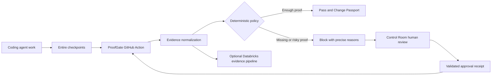

# ProofGate Buildathon Record

## Repository identity

- Official upstream: `https://github.com/entireio/external-agents`
- Fork: `https://github.com/subramanyarao11/external-agents`
- Entire mirror region: India (`aws-ap-south-1`)
- Entire clone path: `/Users/subramanyarao/Desktop/webknot/external-agents`
- Team: Subramanya, Daksh, and Rohit; exact GitHub handles for Daksh and Rohit are pending
- Build agent actually used at kickoff: Codex
- Entire CLI version: `0.10.5`
- Entire Graph version: `v0.4.0`

## Initial understanding and Track 3 fit

ProofGate is intended to turn AI-agent work into reviewable pull-request evidence. It should collect real Entire checkpoint evidence, evaluate that evidence at a deterministic policy boundary, explain why risky or incomplete changes are blocked, and support an explicit human approval path. This extends Entire into GitHub Actions, review operations, and optional Databricks-backed evidence processing without treating model output or self-reported test results as trusted proof.

The planned vertical flow is:

1. A coding agent performs work captured by Entire checkpoints.
2. A GitHub Action collects the available checkpoint, repository, test, and Graph evidence.
3. A deterministic policy engine evaluates normalized evidence and emits precise reasons.
4. Sufficient evidence passes and produces a change passport; missing or risky evidence blocks.
5. A human reviewer may make an explicit Control Room decision that produces an auditable approval receipt.
6. A rerun verifies the receipt and reevaluates the policy; Databricks integrations may persist or analyze evidence where configured.

Trusted inputs are repository state, verifiable Git and Entire metadata, configured policy, test artifacts, and cryptographically or structurally validated approval receipts. Pull-request text, agent claims, arbitrary workflow inputs, unverified checkpoint references, and unsigned approval assertions are untrusted until validated.

## Architecture

The policy engine, rather than a language model, is the enforcement boundary. Entire supplies development provenance; Entire Graph supplies code-relationship evidence that must be checked against source or tests; GitHub Actions supplies the CI gate; human review supplies an explicit exception path; and Databricks is an integration for evidence processing and analytics, not a substitute for deterministic enforcement.

## Assumptions

- The current clone and `origin` are the official Entire-mirrored fork in the India region.
- The user reports that organizers approved reuse of the archived ProofGate baseline. Documentary proof has not been supplied in this workspace and remains pending.
- Imported commits must retain their original SHAs, authors, messages, dates, and ancestry and must not be represented as work authored today.
- The three batches are ordered slices of one preserved 14-commit chain based on official upstream commit `c47a489`.
- New implementation or curveball work begins only after the relevant baseline import and must be captured honestly through Entire.

## Risks and open questions

- Organizer approval cannot yet be independently audited because the approver, timestamp, link, or screenshot is unavailable.
- Later import batches have not yet been inspected or tested in this clone.
- GitHub CLI authentication is available, but hosted Action execution and external service credentials are not yet verified.
- `entire status` reports that Claude Code and OpenCode hooks are out of date; Codex is the build agent used for this kickoff session.
- `entire status` reported that session tracking diverged from `HEAD` immediately after the intentional history merge; after the documentation commits and mirrored push, final status no longer reported that warning. The import ancestry is intact.
- Batch 1 has one archived whitespace defect: `git diff --check main..HEAD` reports a new blank line at EOF in `agents/entire-agent-github-actions/scripts/verify-github-actions.sh`.
- The shared `external-agents-tests` compliance runner is not installed on `PATH`, so local protocol compliance remains blocked pending that external test binary or CI.
- The GitHub Actions e2e adapter deliberately has no hosted `RunPrompt` implementation, causing five tagged lifecycle scenarios to fail locally.
- Databricks and Control Room behavior may depend on credentials or external infrastructure and must not be described as live until demonstrated.
- Exact GitHub handles for Daksh and Rohit are pending.

## Team roles

| Team member | Planned responsibility |
|---|---|
| Subramanya | Baseline importer; end-to-end GitHub Action and deterministic gate integration; integration review; blocked-to-approved rerun demonstration; final verification and submission |
| Daksh | Control Room review flow and failure states; approval receipt integrity; replay/rerun behavior; Databricks control-plane or evidence integration used in the demo |
| Rohit | Entire Graph evidence; impact analysis for risky changes; final semantic diff evidence; Codex/Cursor evidence fixtures and verification tests |

## Approved-baseline disclosure

- Baseline: 14 pre-existing ProofGate commits based on `c47a489` and ending at `6414daf`.
- Import method: ordered `--no-ff` merges from the archived Git bundle, preserving the original history without cherry-picking, re-authoring, squashing, amending, or date changes.
- Organizer exception: approval is reported by the user; documentary proof is pending. No approver, timestamp, link, or screenshot is claimed here.
- Archive source: `/Users/subramanyarao/Desktop/Entire-ProofGate-Kickoff-Pack/git/proofgate-implementation.bundle`
- Imported batch 1: original commits `7e106ff7986e9e40b6c00c20786b7c58c9567c7d` through `6d1396dbcdf0c2d28fdcaa055a14c6d2128eb26f`, merged by `14a4880d55e968b9f47d09d7fdc27a5da5d21561`.
- Entire coverage: kickoff setup, the baseline-import decision and verification, all genuine work after import, curveball work, and final verification. Entire did not capture the archived baseline's original development.
- Importer: Subramanya.
- Batch 1 pull request: `https://github.com/Subramanyarao11/external-agents/pull/2` (open, non-draft, not merged).

`COMMIT_MANIFEST.md` has the correct SHA prefixes and order, but its Subject column contains human-friendly descriptive labels rather than the literal Git subjects. The raw commit objects, `git log`, and patch filenames agree on the original subjects. This wording defect is disclosed here; no archived commit was rewritten to match the labels.

## Ordered baseline import batches

| Batch | Original commits | Planned branch | Scope from descriptive manifest labels | Status |
|---:|---|---|---|---|
| 1 of 3 | `7e106ff..6d1396d` (commits 1-5 after base `c47a489`) | `baseline/01-foundation` | Sponsor/platform research, contract fixtures, Claude checkpoint evidence, deterministic decision engine, and Databricks evidence pipeline | Imported with no-ff merge `14a4880`; verification recorded below; PR #2 open and unmerged |
| 2 of 3 | `3e63e9f..dcb6f5a` (commits 6-10) | To be created after batch 1 review | Control Room/GitHub approvals, Databricks deployment, change passports/Graph metadata, packaged Action/demo setup, and feedback/search stack | Pending batch 1 review |
| 3 of 3 | `261b8cb..6414daf` (commits 11-14) | To be created after batch 2 review | Review continuity/rollout controls, JUnit evidence, Codex/Cursor capture, and final judging/Graph contracts | Pending batch 2 review |

## Kickoff Graph evidence

- Question: Where does this repository verify external-agent lifecycle event integration?
- Command: `entire graph search --repo . --profile full --query "external agent lifecycle integration and protocol test harness"`
- Result: the top result was `TestParseHookLifecycleEvents` in `agents/entire-agent-grok/internal/grok/agent_test.go`, beginning at line 186.
- Verification against source: focused inspection of lines 180-270 confirmed that the test maps supported hook names to lifecycle event types, expects unsupported tool/subagent hooks to return no event, and checks session ID, session reference, and metadata preservation.
- Confidence and uncertainty: confirmed for the Grok adapter test only; the result does not by itself prove every adapter or end-to-end lifecycle path.
- Decision influenced: baseline and later changes will be checked with focused source inspection and the relevant adapter, protocol, lifecycle, and ProofGate tests rather than relying on Graph search output alone.

### Batch 1 Graph lookup

- Question: Where does batch 1 connect deterministic ProofGate evaluation to its Databricks evidence path?
- Command: `entire graph search --repo . --profile full --query "ProofGate deterministic policy evaluation and Databricks evidence pipeline"`
- Result: the top hit was `export` in `proofgate/cmd/proofgate/main.go`; related results included `DefaultPolicy`, `Evaluate`, the `bronze_checkpoint_events` table, and `BuildEvent`/warehouse code.
- Verification against source: focused inspection confirmed that `export` decodes a Change Passport and optional policy, calls `engine.Evaluate`, builds an allowlisted warehouse event, supports a no-network dry run, and only then constructs the Databricks client. `engine.Evaluate` applies deterministic scores and hard stops; `warehouse.BuildEvent` refuses unsafe export and omits raw file/entity values; the client uses a parameterized idempotent `MERGE`.
- Confidence and uncertainty: confirmed for the imported source and local tests. No live Databricks call or hosted GitHub Actions run was performed.
- Decision influenced: batch 1 verification included both deterministic CLI examples and the dry-run export, while live external integrations remain explicitly unclaimed.

## Batch 1 import verification

### Original history

- Bundle verification: `git bundle verify /Users/subramanyarao/Desktop/Entire-ProofGate-Kickoff-Pack/git/proofgate-implementation.bundle` passed; the bundle reports complete SHA-1 history, base ref `c47a4893a102f3a7a8bff794a820455109b29c95`, and archive tip `6414daff9a749daff0e4058590c65a02ae6d38a4`.
- Fetch: `git fetch --force proofgate-archive archive/proofgate-implementation` completed from the local bundle.
- Count and ancestry: `git rev-list --count --first-parent c47a489..6d1396d` returned `5`; `git merge-base c47a489 6d1396d` returned the full base SHA; each commit's sole parent is the preceding object.
- Full batch sequence: `7e106ff7986e9e40b6c00c20786b7c58c9567c7d`, `ba24077429e9965f01db77e6db8ce80c73999119`, `9cef0562d1e8c30dccb51b6aa1b81eba93e84f89`, `a093fd32c491b6b9cc658703e75a5ad5114ebfaa`, `6d1396dbcdf0c2d28fdcaa055a14c6d2128eb26f`.
- Identity and dates: all five commit objects retain author and committer `Subramanyarao11 <subramanya11rao@gmail.com>` and the dates stored in the bundle, ranging from `2026-09-04T15:47:07+05:30` through `2026-09-04T17:39:26+05:30`.
- Literal Git subjects: `docs: research GitHub Actions external agent`; `test: scaffold GitHub Actions external agent`; `feat: capture Claude GitHub Actions sessions`; `feat: add deterministic ProofGate decision engine`; `feat: add governed Databricks evidence pipeline`.
- Merge: `git merge --no-ff 6d1396d -m "chore: import approved ProofGate baseline batch 1 of 3"` created merge commit `14a4880d55e968b9f47d09d7fdc27a5da5d21561` with parents `9fa8f33056af0a3c056f7690db577b1a9c12cacc` and `6d1396dbcdf0c2d28fdcaa055a14c6d2128eb26f`.

### Commands and results

- `git diff --check main..HEAD`: **FAIL** — `agents/entire-agent-github-actions/scripts/verify-github-actions.sh:120: new blank line at EOF.` The archived source was not changed.
- `go test ./...` in `agents/entire-agent-github-actions`: **PASS**.
- `go build -o /private/tmp/entire-agent-github-actions-batch1 ./cmd/entire-agent-github-actions`: **PASS**.
- `go test ./...` in `proofgate`: initial sandbox run could not bind the loopback listener used by `httptest`; the same command rerun with loopback access **PASS** for `engine` and `warehouse`.
- `go build ./...` in `proofgate`: **PASS**.
- `go test ./...` in `e2e` without the `e2e` tag: **PASS** for the ordinary package/unit target.
- `./scripts/verify-github-actions.sh --sample`: **PASS** for the source-derived local structure fixture, with expected warnings that it is not a live GitHub runner verdict.
- `./scripts/verify-compliance.sh /private/tmp/entire-agent-github-actions-batch1`: **BLOCKED** — `external-agents-tests` is not installed on `PATH`.
- Both documented `go run ./cmd/proofgate evaluate` examples: **PASS**, producing `PASS` for `examples/pass.json` and `APPROVAL_REQUIRED` for `examples/approval-required.json` at the documented evaluation time.
- `go run ./cmd/proofgate export --passport examples/pass.json --now 2026-09-04T12:00:00Z --dry-run`: **PASS**, producing an allowlisted event without network transmission.
- `E2E_AGENT=github-actions ... go test -tags=e2e -v -count=1 ./...` in `e2e`: **FAIL**. `TestLifecycle_DetectAndEnable` and `TestLifecycle_HooksInstalledAfterEnable` passed; five prompt-dependent cases (`SinglePromptManualCommit`, `MultiplePromptsManualCommit`, `RewindPreCommit`, `RewindAfterCommit`, and `SessionPersistence`) failed because the adapter returns `hosted GitHub Actions lifecycle runner not implemented`; interactive and OMP-only cases skipped.

## Checkpoints and later evidence

- Kickoff setup commit: `3785c8c481b471023191916b0cdf86aac3e2c693`; protected-main setup merge: `9fa8f33056af0a3c056f7690db577b1a9c12cacc`.
- Last stable state before curveball: pending.
- Curveball wording and response: pending; no curveball has been supplied in this record.
- Pre-change Graph impact analysis: pending for the first risky implementation change.
- Final semantic Graph diff: pending.
- Offline verification: batch 1 results are recorded above; unit tests and local deterministic flows pass, while diff-check, external compliance availability, and hosted lifecycle coverage have genuine limitations.
- GitHub Action run, blocked PR, approval receipt, successful rerun, Databricks proof, and demo video: pending.

## Known limitations

This record documents the verified history and local behavior of baseline batch 1. It does not claim that the imported work was newly authored during this event, that the archived whitespace defect is fixed, that shared protocol compliance ran locally, or that a hosted GitHub Action, live Control Room, Databricks deployment, approval artifact, or end-to-end rerun has been demonstrated.
