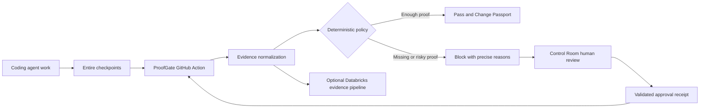

# ProofGate Buildathon Record

## Repository identity

- Official upstream: `https://github.com/entireio/external-agents`
- Fork: `https://github.com/subramanyarao11/external-agents`
- Entire mirror region: India (`aws-ap-south-1`)
- Entire clone path: `/Users/subramanyarao/Desktop/webknot/external-agents`
- Team: Subramanya, Daksh, and Rohit; exact GitHub handles for Daksh and Rohit are pending
- Build agent actually used at kickoff: Codex
- Entire CLI version: `0.10.5`
- Entire Graph version: `v0.4.0`

## Initial understanding and Track 3 fit

ProofGate is intended to turn AI-agent work into reviewable pull-request evidence. It should collect real Entire checkpoint evidence, evaluate that evidence at a deterministic policy boundary, explain why risky or incomplete changes are blocked, and support an explicit human approval path. This extends Entire into GitHub Actions, review operations, and optional Databricks-backed evidence processing without treating model output or self-reported test results as trusted proof.

The planned vertical flow is:

1. A coding agent performs work captured by Entire checkpoints.
2. A GitHub Action collects the available checkpoint, repository, test, and Graph evidence.
3. A deterministic policy engine evaluates normalized evidence and emits precise reasons.
4. Sufficient evidence passes and produces a change passport; missing or risky evidence blocks.
5. A human reviewer may make an explicit Control Room decision that produces an auditable approval receipt.
6. A rerun verifies the receipt and reevaluates the policy; Databricks integrations may persist or analyze evidence where configured.

Trusted inputs are repository state, verifiable Git and Entire metadata, configured policy, test artifacts, and cryptographically or structurally validated approval receipts. Pull-request text, agent claims, arbitrary workflow inputs, unverified checkpoint references, and unsigned approval assertions are untrusted until validated.

## Architecture

The policy engine, rather than a language model, is the enforcement boundary. Entire supplies development provenance; Entire Graph supplies code-relationship evidence that must be checked against source or tests; GitHub Actions supplies the CI gate; human review supplies an explicit exception path; and Databricks is an integration for evidence processing and analytics, not a substitute for deterministic enforcement.

## Assumptions

- The current clone and `origin` are the official Entire-mirrored fork in the India region.
- The user reports that organizers approved reuse of the archived ProofGate baseline. Documentary proof has not been supplied in this workspace and remains pending.
- Imported commits must retain their original SHAs, authors, messages, dates, and ancestry and must not be represented as work authored today.
- The three batches are ordered slices of one preserved 14-commit chain based on official upstream commit `c47a489`.
- New implementation or curveball work begins only after the relevant baseline import and must be captured honestly through Entire.

## Risks and open questions

- Organizer approval cannot yet be independently audited because the approver, timestamp, link, or screenshot is unavailable.
- The archive and each commit still require object-level and manifest verification before import.
- Later import batches have not yet been inspected or tested in this clone.
- GitHub authentication, PR creation, Action execution, and external service credentials are not yet verified.
- `entire status` reports that Claude Code and OpenCode hooks are out of date; Codex is the build agent used for this kickoff session.
- Databricks and Control Room behavior may depend on credentials or external infrastructure and must not be described as live until demonstrated.
- Exact GitHub handles for Daksh and Rohit are pending.

## Team roles

| Team member | Planned responsibility |
|---|---|
| Subramanya | Baseline importer; end-to-end GitHub Action and deterministic gate integration; integration review; blocked-to-approved rerun demonstration; final verification and submission |
| Daksh | Control Room review flow and failure states; approval receipt integrity; replay/rerun behavior; Databricks control-plane or evidence integration used in the demo |
| Rohit | Entire Graph evidence; impact analysis for risky changes; final semantic diff evidence; Codex/Cursor evidence fixtures and verification tests |

## Approved-baseline disclosure

- Baseline: 14 pre-existing ProofGate commits based on `c47a489` and ending at `6414daf`.
- Import method: ordered `--no-ff` merges from the archived Git bundle, preserving the original history without cherry-picking, re-authoring, squashing, amending, or date changes.
- Organizer exception: approval is reported by the user; documentary proof is pending. No approver, timestamp, link, or screenshot is claimed here.
- Archive source: `/Users/subramanyarao/Desktop/Entire-ProofGate-Kickoff-Pack/git/proofgate-implementation.bundle`
- Entire coverage: kickoff setup, the baseline-import decision and verification, all genuine work after import, curveball work, and final verification. Entire did not capture the archived baseline's original development.
- Importer: Subramanya.
- Pull-request links: pending until each PR is created.

## Ordered baseline import batches

| Batch | Original commits | Planned branch | Scope from archived subjects | Status |
|---:|---|---|---|---|
| 1 of 3 | `7e106ff..6d1396d` (commits 1-5 after base `c47a489`) | `baseline/01-foundation` | Sponsor/platform research, contract fixtures, Claude checkpoint evidence, deterministic decision engine, and Databricks evidence pipeline | Planned; archive and commits not yet verified in this clone |
| 2 of 3 | `3e63e9f..dcb6f5a` (commits 6-10) | To be created after batch 1 review | Control Room/GitHub approvals, Databricks deployment, change passports/Graph metadata, packaged Action/demo setup, and feedback/search stack | Pending batch 1 review |
| 3 of 3 | `261b8cb..6414daf` (commits 11-14) | To be created after batch 2 review | Review continuity/rollout controls, JUnit evidence, Codex/Cursor capture, and final judging/Graph contracts | Pending batch 2 review |

## Kickoff Graph evidence

- Question: Where does this repository verify external-agent lifecycle event integration?
- Command: `entire graph search --repo . --profile full --query "external agent lifecycle integration and protocol test harness"`
- Result: the top result was `TestParseHookLifecycleEvents` in `agents/entire-agent-grok/internal/grok/agent_test.go`, beginning at line 186.
- Verification against source: focused inspection of lines 180-270 confirmed that the test maps supported hook names to lifecycle event types, expects unsupported tool/subagent hooks to return no event, and checks session ID, session reference, and metadata preservation.
- Confidence and uncertainty: confirmed for the Grok adapter test only; the result does not by itself prove every adapter or end-to-end lifecycle path.
- Decision influenced: baseline and later changes will be checked with focused source inspection and the relevant adapter, protocol, lifecycle, and ProofGate tests rather than relying on Graph search output alone.

## Checkpoints and later evidence

- Kickoff commit: pending.
- Last stable state before curveball: pending.
- Curveball wording and response: pending; no curveball has been supplied in this record.
- Pre-change Graph impact analysis: pending for the first risky implementation change.
- Final semantic Graph diff: pending.
- Offline verification: pending baseline import.
- GitHub Action run, blocked PR, approval receipt, successful rerun, Databricks proof, and demo video: pending.

## Known limitations

This record currently documents setup and an import plan. It does not yet claim a verified baseline import, a working GitHub Action, a live Control Room, a Databricks deployment, a recorded approval artifact, or end-to-end proof.
