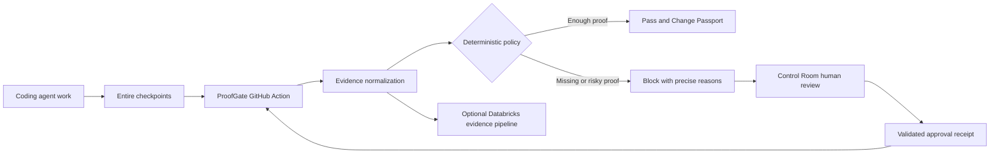

# ProofGate Buildathon Record

## Repository identity

- Official upstream: `https://github.com/entireio/external-agents`
- Fork: `https://github.com/subramanyarao11/external-agents`
- Entire mirror region: India (`aws-ap-south-1`)
- Entire clone path: `/Users/subramanyarao/Desktop/webknot/external-agents`
- Team: Subramanya, Daksh, and Rohit; exact GitHub handles for Daksh and Rohit are pending
- Build agent actually used at kickoff: Codex
- Entire CLI version: `0.10.5`
- Entire Graph version: `v0.4.0`

## Initial understanding and Track 3 fit

ProofGate is intended to turn AI-agent work into reviewable pull-request evidence. It should collect real Entire checkpoint evidence, evaluate that evidence at a deterministic policy boundary, explain why risky or incomplete changes are blocked, and support an explicit human approval path. This extends Entire into GitHub Actions, review operations, and optional Databricks-backed evidence processing without treating model output or self-reported test results as trusted proof.

The planned vertical flow is:

1. A coding agent performs work captured by Entire checkpoints.
2. A GitHub Action collects the available checkpoint, repository, test, and Graph evidence.
3. A deterministic policy engine evaluates normalized evidence and emits precise reasons.
4. Sufficient evidence passes and produces a change passport; missing or risky evidence blocks.
5. A human reviewer may make an explicit Control Room decision that produces an auditable approval receipt.
6. A rerun verifies the receipt and reevaluates the policy; Databricks integrations may persist or analyze evidence where configured.

Trusted inputs are repository state, verifiable Git and Entire metadata, configured policy, test artifacts, and cryptographically or structurally validated approval receipts. Pull-request text, agent claims, arbitrary workflow inputs, unverified checkpoint references, and unsigned approval assertions are untrusted until validated.

## Architecture

The policy engine, rather than a language model, is the enforcement boundary. Entire supplies development provenance; Entire Graph supplies code-relationship evidence that must be checked against source or tests; GitHub Actions supplies the CI gate; human review supplies an explicit exception path; and Databricks is an integration for evidence processing and analytics, not a substitute for deterministic enforcement.

## Assumptions

- The current clone and `origin` are the official Entire-mirrored fork in the India region.
- The user reports that organizers approved reuse of the archived ProofGate baseline. Documentary proof has not been supplied in this workspace and remains pending.
- Imported commits must retain their original SHAs, authors, messages, dates, and ancestry and must not be represented as work authored today.
- The three batches are ordered slices of one preserved 14-commit chain based on official upstream commit `c47a489`.
- New implementation or curveball work begins only after the relevant baseline import and must be captured honestly through Entire.

## Risks and open questions

- Organizer approval cannot yet be independently audited because the approver, timestamp, link, or screenshot is unavailable.
- Later import batches have not yet been inspected or tested in this clone.
- GitHub CLI authentication is available, but hosted Action execution and external service credentials are not yet verified.
- `entire status` reports that Claude Code and OpenCode hooks are out of date; Codex is the build agent used for this kickoff session.
- `entire status` reported that session tracking diverged from `HEAD` immediately after the intentional history merge; after the documentation commits and mirrored push, final status no longer reported that warning. The import ancestry is intact.
- Batch 1 has one archived whitespace defect: `git diff --check main..HEAD` reports a new blank line at EOF in `agents/entire-agent-github-actions/scripts/verify-github-actions.sh`.
- The repository-declared `external-agents-tests` runner is installed through mise, and the shared compliance suite passes every applicable hooks, mandatory, token-calculator, and transcript-analyzer test; only capabilities not declared by this adapter are skipped.
- The hosted curveball lint issue was remediated with localized, behavior-preserving changes. On head `d20a5ec`, the manually dispatched hosted [CI run](https://github.com/Subramanyarao11/external-agents/actions/runs/34019549183), [Lint run](https://github.com/Subramanyarao11/external-agents/actions/runs/34019548647), and [License Check run](https://github.com/Subramanyarao11/external-agents/actions/runs/34019549277) all passed; the pinned local lint gate and shared compliance suite also pass.
- The GitHub Actions e2e adapter deliberately has no hosted `RunPrompt` implementation, causing five tagged lifecycle scenarios to fail locally.
- Databricks and Control Room behavior may depend on credentials or external infrastructure and must not be described as live until demonstrated.
- Exact GitHub handles for Daksh and Rohit are pending.

## Team roles

| Team member | Planned responsibility |
|---|---|
| Subramanya | Baseline importer; end-to-end GitHub Action and deterministic gate integration; integration review; blocked-to-approved rerun demonstration; final verification and submission |
| Daksh | Control Room review flow and failure states; approval receipt integrity; replay/rerun behavior; Databricks control-plane or evidence integration used in the demo |
| Rohit | Entire Graph evidence; impact analysis for risky changes; final semantic diff evidence; Codex/Cursor evidence fixtures and verification tests |

## Approved-baseline disclosure

- Baseline: 14 pre-existing ProofGate commits based on `c47a489` and ending at `6414daf`.
- Import method: ordered `--no-ff` merges from the archived Git bundle, preserving the original history without cherry-picking, re-authoring, squashing, amending, or date changes.
- Organizer exception: approval is reported by the user; documentary proof is pending. No approver, timestamp, link, or screenshot is claimed here.
- Archive source: `/Users/subramanyarao/Desktop/Entire-ProofGate-Kickoff-Pack/git/proofgate-implementation.bundle`
- Imported batch 1: original commits `7e106ff7986e9e40b6c00c20786b7c58c9567c7d` through `6d1396dbcdf0c2d28fdcaa055a14c6d2128eb26f`, merged by `14a4880d55e968b9f47d09d7fdc27a5da5d21561`.
- Entire coverage: kickoff setup, the baseline-import decision and verification, all genuine work after import, curveball work, and final verification. Entire did not capture the archived baseline's original development.
- Importer: Subramanya.
- Batch 1 pull request: `https://github.com/Subramanyarao11/external-agents/pull/2` (merged into `main` at `2026-09-06T06:25:31Z`).

`COMMIT_MANIFEST.md` has the correct SHA prefixes and order, but its Subject column contains human-friendly descriptive labels rather than the literal Git subjects. The raw commit objects, `git log`, and patch filenames agree on the original subjects. This wording defect is disclosed here; no archived commit was rewritten to match the labels.

## Ordered baseline import batches

| Batch | Original commits | Planned branch | Scope from descriptive manifest labels | Status |
|---:|---|---|---|---|
| 1 of 3 | `7e106ff..6d1396d` (commits 1-5 after base `c47a489`) | `baseline/01-foundation` | Sponsor/platform research, contract fixtures, Claude checkpoint evidence, deterministic decision engine, and Databricks evidence pipeline | Imported with no-ff merge `14a4880`; verification recorded below; PR #2 merged at `2026-09-06T06:25:31Z` |
| 2 of 3 | `3e63e9f..dcb6f5a` (commits 6-10) | `baseline/02-control-room` | Control Room/GitHub approvals, Databricks deployment, change passports/Graph metadata, packaged Action/demo setup, and feedback/search stack | Imported with no-ff merge `02cb301`; verification recorded below |
| 3 of 3 | `261b8cb..6414daf` (commits 11-14) | `baseline/03-final-integrations` | Review continuity/rollout controls, JUnit evidence, Codex/Cursor capture, and final judging/Graph contracts | Imported with no-ff merge `b15c06f`; verification recorded below |

## Kickoff Graph evidence

- Question: Where does this repository verify external-agent lifecycle event integration?
- Command: `entire graph search --repo . --profile full --query "external agent lifecycle integration and protocol test harness"`
- Result: the top result was `TestParseHookLifecycleEvents` in `agents/entire-agent-grok/internal/grok/agent_test.go`, beginning at line 186.
- Verification against source: focused inspection of lines 180-270 confirmed that the test maps supported hook names to lifecycle event types, expects unsupported tool/subagent hooks to return no event, and checks session ID, session reference, and metadata preservation.
- Confidence and uncertainty: confirmed for the Grok adapter test only; the result does not by itself prove every adapter or end-to-end lifecycle path.
- Decision influenced: baseline and later changes will be checked with focused source inspection and the relevant adapter, protocol, lifecycle, and ProofGate tests rather than relying on Graph search output alone.

### Batch 1 Graph lookup

- Question: Where does batch 1 connect deterministic ProofGate evaluation to its Databricks evidence path?
- Command: `entire graph search --repo . --profile full --query "ProofGate deterministic policy evaluation and Databricks evidence pipeline"`
- Result: the top hit was `export` in `proofgate/cmd/proofgate/main.go`; related results included `DefaultPolicy`, `Evaluate`, the `bronze_checkpoint_events` table, and `BuildEvent`/warehouse code.
- Verification against source: focused inspection confirmed that `export` decodes a Change Passport and optional policy, calls `engine.Evaluate`, builds an allowlisted warehouse event, supports a no-network dry run, and only then constructs the Databricks client. `engine.Evaluate` applies deterministic scores and hard stops; `warehouse.BuildEvent` refuses unsafe export and omits raw file/entity values; the client uses a parameterized idempotent `MERGE`.
- Confidence and uncertainty: confirmed for the imported source and local tests. No live Databricks call or hosted GitHub Actions run was performed.
- Decision influenced: batch 1 verification included both deterministic CLI examples and the dry-run export, while live external integrations remain explicitly unclaimed.

## Batch 1 import verification

### Original history

- Bundle verification: `git bundle verify /Users/subramanyarao/Desktop/Entire-ProofGate-Kickoff-Pack/git/proofgate-implementation.bundle` passed; the bundle reports complete SHA-1 history, base ref `c47a4893a102f3a7a8bff794a820455109b29c95`, and archive tip `6414daff9a749daff0e4058590c65a02ae6d38a4`.
- Fetch: `git fetch --force proofgate-archive archive/proofgate-implementation` completed from the local bundle.
- Count and ancestry: `git rev-list --count --first-parent c47a489..6d1396d` returned `5`; `git merge-base c47a489 6d1396d` returned the full base SHA; each commit's sole parent is the preceding object.
- Full batch sequence: `7e106ff7986e9e40b6c00c20786b7c58c9567c7d`, `ba24077429e9965f01db77e6db8ce80c73999119`, `9cef0562d1e8c30dccb51b6aa1b81eba93e84f89`, `a093fd32c491b6b9cc658703e75a5ad5114ebfaa`, `6d1396dbcdf0c2d28fdcaa055a14c6d2128eb26f`.
- Identity and dates: all five commit objects retain author and committer `Subramanyarao11 <subramanya11rao@gmail.com>` and the dates stored in the bundle, ranging from `2026-09-04T15:47:07+05:30` through `2026-09-04T17:39:26+05:30`.
- Literal Git subjects: `docs: research GitHub Actions external agent`; `test: scaffold GitHub Actions external agent`; `feat: capture Claude GitHub Actions sessions`; `feat: add deterministic ProofGate decision engine`; `feat: add governed Databricks evidence pipeline`.
- Merge: `git merge --no-ff 6d1396d -m "chore: import approved ProofGate baseline batch 1 of 3"` created merge commit `14a4880d55e968b9f47d09d7fdc27a5da5d21561` with parents `9fa8f33056af0a3c056f7690db577b1a9c12cacc` and `6d1396dbcdf0c2d28fdcaa055a14c6d2128eb26f`.

### Commands and results

- `git diff --check main..HEAD`: **FAIL** — `agents/entire-agent-github-actions/scripts/verify-github-actions.sh:120: new blank line at EOF.` The archived source was not changed.
- `go test ./...` in `agents/entire-agent-github-actions`: **PASS**.
- `go build -o /private/tmp/entire-agent-github-actions-batch1 ./cmd/entire-agent-github-actions`: **PASS**.
- `go test ./...` in `proofgate`: initial sandbox run could not bind the loopback listener used by `httptest`; the same command rerun with loopback access **PASS** for `engine` and `warehouse`.
- `go build ./...` in `proofgate`: **PASS**.
- `go test ./...` in `e2e` without the `e2e` tag: **PASS** for the ordinary package/unit target.
- `./scripts/verify-github-actions.sh --sample`: **PASS** for the source-derived local structure fixture, with expected warnings that it is not a live GitHub runner verdict.
- `GOCACHE=/private/tmp/external-agents-compliance-go-cache go build -o /private/tmp/entire-agent-github-actions-curveball ./cmd/entire-agent-github-actions`, followed by `mise exec -- ./scripts/verify-compliance.sh /private/tmp/entire-agent-github-actions-curveball`: **PASS** for every applicable shared hooks, mandatory, token-calculator, and transcript-analyzer test; only capabilities not declared by this adapter were skipped.
- Both documented `go run ./cmd/proofgate evaluate` examples: **PASS**, producing `PASS` for `examples/pass.json` and `APPROVAL_REQUIRED` for `examples/approval-required.json` at the documented evaluation time.
- `go run ./cmd/proofgate export --passport examples/pass.json --now 2026-09-04T12:00:00Z --dry-run`: **PASS**, producing an allowlisted event without network transmission.
- `E2E_AGENT=github-actions ... go test -tags=e2e -v -count=1 ./...` in `e2e`: **FAIL**. `TestLifecycle_DetectAndEnable` and `TestLifecycle_HooksInstalledAfterEnable` passed; five prompt-dependent cases (`SinglePromptManualCommit`, `MultiplePromptsManualCommit`, `RewindPreCommit`, `RewindAfterCommit`, and `SessionPersistence`) failed because the adapter returns `hosted GitHub Actions lifecycle runner not implemented`; interactive and OMP-only cases skipped.

## Checkpoints and later evidence

- Kickoff setup commit: `3785c8c481b471023191916b0cdf86aac3e2c693`; protected-main setup merge: `9fa8f33056af0a3c056f7690db577b1a9c12cacc`.
- Last stable state before curveball: checkpoint `e7d282cc52ef`; `main` merge `afa145d570aa0afd5098c3410d7fd30a3bd6ed4d`; tree `faec0a1933e7c5ad61ace58bdc878e10e5819db8`, independently equal to the tree at baseline tip `11fd1a58800590f89fe0d2ffb7cbab30c9fb49c2`.
- Noon curveball: the integrated workflow introduced a JSONL transcript/lifecycle record format while existing users retain the original JSON array. Both must work through shared logic; unknown records must not crash; an incomplete trailing JSONL record must yield all complete evidence; malformed complete records remain errors; raw transcript and checkpoint behavior remain compatible.
- Official fixture normalization: `agents/entire-agent-github-actions/testdata/claude-action-execution-v2.jsonl` preserves all 17 supplied records and values. The only normalization mechanically restored the chat renderer's `\_` display escapes to ordinary underscores.
- Tests-first checkpoint: `aa7addaf3c1477002679c47112987b6afe58f02f` (`test(github-actions): define curveball transcript contract`). Before implementation, the legacy-array subtest passed and the malformed-complete-record test passed; official JSONL, inserted-unknown, incomplete-tail, and direct capture tests failed at the old single-document parser with `invalid character '{' after top-level value`.
- Revised design: `parseSDKMessages` is the sole format detector. Legacy arrays/envelopes pass through unchanged; JSONL records are normalized into the existing `sdkMessage` model, after which the existing file, prompt, summary, token, model, position, and compact paths are reused. Recognized `file_changed` records enter the existing modified-file allowlist. Valid unknown events are skipped. Any genuinely unterminated final record yields all messages parsed so far, including an empty partial result when the first record is incomplete. `WriteSession` continues to store the original bytes atomically, and `CaptureStart`/`CaptureFinish` continue to emit `run-start`, `turn-start`, `turn-end`, `run-end` in that order.
- Independent verifier: `verify-github-actions.sh` now normalizes either an array or an object stream before extracting session/model/prompt/count evidence. The source-derived legacy sample and official 17-record JSONL fixture both pass locally.
- Final semantic Graph diff: `entire graph diff --base afa145d570aa0afd5098c3410d7fd30a3bd6ed4d --head HEAD --json` reported the expected `parseSDKMessages` change, the JSONL normalization and incomplete-tail helpers, the curveball parser/capture/lifecycle tests, the independent verifier, and documentation. It found no unrelated implementation symbols. Graph reported `claude-action-execution-v2.jsonl` as unsupported because it has no JSONL parser, so the fixture was validated directly as 17 valid JSON records with no remaining `\_` display escapes.
- Offline verification: curveball contract tests pass; the full GitHub Actions agent module passes and builds; `git diff --check` passes; ProofGate passes after granting its `httptest` loopback listener; untagged e2e passes; focused real-CLI `DetectAndEnable` and `HooksInstalledAfterEnable` lifecycle checks pass for `github-actions`.
- Remaining verification gaps: the hosted GitHub Actions `RunPrompt` adapter remains unimplemented, so prompt/rewind/session-persistence lifecycle scenarios are not claimed. No credential-dependent hosted Action, Databricks deployment, or Control Room execution was performed.
- GitHub Action run, blocked PR, approval receipt, successful rerun, Databricks proof, and demo video: pending.

### Noon curveball Graph impact evidence

- Initial locate: `entire graph search --repo . --profile full --query "Support original and new transcript and lifecycle event formats, tolerate unknown events, preserve partial incomplete transcripts, and keep checkpoint behavior compatible"` recorded commit `afa145d`, tree `faec0a1`, and identified transcript sanitization/checkpoint neighbors; source inspection showed the top Grok hit was not the target adapter.
- Targeted locate: `entire graph search --repo . --profile full --query "GitHub Actions external agent Claude JSONL transcript parser lifecycle event handler session summary protocol response checkpoint writer and tests"` found the GitHub Actions transcript contract and capture paths. Results were verified against `transcript.go`, `capture.go`, `hooks.go`, protocol handlers, tests, and the independent shell verifier.
- Relationship analysis: `entire graph impact --repo . --symbol parseSDKMessages` reported four direct and five transitive callers: `CaptureFinish`, `executionModel`, `CalculateTokens`, `readSDKMessages`, `GetTranscriptPosition`, `ExtractModifiedFiles`, `ExtractPrompts`, `ExtractSummary`, and `CompactTranscript`. This established the parser as the one shared normalization seam.
- Lifecycle impact: `entire graph impact --repo . --symbol Agent.ParseHook --file agents/entire-agent-github-actions/internal/githubactions/hooks.go --line 21 --format json` identified its session-path and metadata dependencies. Source verification additionally confirmed the process boundary through `HandleParseHook` and `main.go`, which Graph did not represent as a Go caller.
- Capture/checkpoint impact: `entire graph impact --repo . --symbol Agent.CaptureFinish --file agents/entire-agent-github-actions/internal/githubactions/capture.go --line 66 --format json` reported 17 callees, including parsing, raw `WriteSession`, modified files, summary, tokens/model, session resolution, and lifecycle dispatch. Source verification confirmed the adapter writes the native session and invokes `entire hooks`; Entire CLI owns shadow and persistent checkpoint writes.
- Graph completeness: Go analysis had no parse failures. Two Databricks SQL parse warnings were unrelated to this Go adapter change and were verified not to affect the impact result.

## Batch 2 import verification

### Import details

- Importer: Daksh
- Branch: `baseline/02-control-room`
- Archive source: `/Users/daksh/GolandProjects/Entire-ProofGate-Kickoff-Pack/git/proofgate-implementation.bundle`
- Bundle verification: passed; complete SHA-1 history, base ref `c47a489`, archive tip `6414daf`.
- Batch 2 commits (5 in order): `3e63e9f`, `7c615c5`, `2a34aa4`, `3f524e3`, `dcb6f5a`.
- Literal Git subjects: `feat: add transactional ProofGate control room`; `feat: add Databricks-native ProofGate control plane`; `feat: build change passports from Entire checkpoints`; `feat: package ProofGate for GitHub Actions`; `feat: close the Databricks evidence feedback loop`.
- Merge: `git merge --no-ff dcb6f5a -m "chore: import approved ProofGate baseline batch 2 of 3"` created merge commit `02cb301`.
- Merge conflicts: none.

### Graph evidence (batch 2)

- Query 1: `entire graph search --repo . --profile full --query "Control Room human review approval receipt validation GitHub Actions"`
  - Top results: GitHub Actions adapter methods (`Name`, `Binary`, `EntireAgent`), capture metadata (`githubMetadata`), hooks (`generatedAction`), and session directory paths.
  - Verification: confirmed existing adapter structure. No Control Room symbols exist on main; batch 2 introduces the Control Room app under `proofgate/app/`.
- Query 2: `entire graph search --repo . --profile full --query "Databricks control plane deployment evidence pipeline warehouse"`
  - Top results: `historyEvidence`, `Evaluate`, `Client.execute`, `export`, `similaritySummary`, `fingerprint` in proofgate engine/warehouse code.
  - Verification: confirmed batch 1 Databricks warehouse client and evaluator are intact. Batch 2 extends with phase 2 Databricks pipeline, warehouse feedback loop, and passport builder.
- Semantic diff: `entire graph diff --base main --head HEAD --json` confirmed changes are confined to: `.github/actions/proofgate-evaluate/action.yml`, `proofgate/app/` (Control Room), `proofgate/cmd/proofgate/ci.go` and `ci_test.go`, `proofgate/passportbuilder/`, `proofgate/warehouse/` extensions, `proofgate/databricks/phase2/`, `proofgate/examples/`, and documentation updates. No unrelated implementation symbols were changed.
- SQL parse warnings: Databricks SQL files (`001_setup.sql`, `002_transform.sql`) produce tree-sitter parse warnings (parameterized identifiers and `ARRAY<>` syntax). These are pre-existing from batch 1 and do not affect Go analysis.

### Commands and results

- `go test ./...` in `agents/entire-agent-github-actions`: **PASS** (including all curveball tests).
- `go build ./...` in `agents/entire-agent-github-actions`: **PASS**.
- `go test ./...` in `proofgate`: **PASS** (`cmd/proofgate`, `engine`, `passportbuilder`, `warehouse`).
- `go build ./...` in `proofgate`: **PASS**.
- `go test ./...` in `e2e`: **PASS**.
- `./agents/entire-agent-github-actions/scripts/verify-github-actions.sh --sample`: **PASS** (local structure fixture; not a live GitHub runner verdict).
- `go run ./cmd/proofgate evaluate --passport examples/pass.json --now 2026-09-04T12:00:00Z`: **PASS** (decision `PASS`).
- `go run ./cmd/proofgate evaluate --passport examples/approval-required.json --now 2026-09-04T12:00:00Z`: **PASS** (decision `APPROVAL_REQUIRED`).
- `go run ./cmd/proofgate export --passport examples/pass.json --now 2026-09-04T12:00:00Z --dry-run`: **PASS** (allowlisted event without network transmission).
- `go test -v ./passportbuilder/`: **PASS** (4 tests: `TestBuildFromEntireCheckpointAndTestEvidence`, `TestBuildWithoutCheckpointPreservesAIAuthoredSignal`, `TestBuildDetectsSecretShapeWithoutRetainingDiff`, `TestSkippedRequiredSuiteIsMarkedMissing`).
- `git diff --check main..HEAD`: **FAIL** — 7 archived whitespace defects (blank line at EOF) in `proofgate/app/.gitignore`, `proofgate/app/explainer.py`, `proofgate/app/similarity.py`, `proofgate/app/warehouse_sync.py`, `proofgate/databricks/phase2/README.md`, `proofgate/databricks/phase2/pipeline/proofgate_features.py`, `proofgate/examples/test-report.json`. These are from the original archived commits and were not modified.

### Offline vs live distinction

- **Offline (verified)**: All Go tests, builds, CLI examples, local structure verification, graph searches and diff.
- **Live (unverified)**: Hosted GitHub Action execution, live Databricks deployment and SQL warehouse, Control Room running against real Databricks Apps, approval receipt round-trip with actual GitHub PR, warehouse sync and feedback loop with live credentials.

## Batch 3 import verification

### Environment disclosure

Batch 3 was imported from a second Entire-enabled clone at
`C:\Users\TECQNIO\Downloads\external-agents` (Windows, `origin` unchanged), not the
macOS clone recorded above. The kickoff pack was supplied as
`C:\Users\TECQNIO\Downloads\Entire-ProofGate-Kickoff-Pack.zip` and extracted to
`C:\Users\TECQNIO\Downloads\proofgate-pack-extracted\Entire-ProofGate-Kickoff-Pack`.
Batches 1 and 2 reached this clone only through `git pull` from `origin`; the
batch 3 archive commits are descendants of `dcb6f5a` and were never pushed to
`origin`, so the bundle was required.

### Preconditions

- `git merge-base --is-ancestor dcb6f5a HEAD`: **PASS** on `main` at `007147f`.
- `git merge-base --is-ancestor d20a5ec HEAD`: **PASS**, confirming the curveball work is present.
- Batch 2 integrity independently checked: `02cb301` is a two-parent no-ff merge of
  `5999589` and `dcb6f5a`, carrying archived commits `3e63e9f`, `7c615c5`, `2a34aa4`,
  `3f524e3`, `dcb6f5a` with their original subjects. Archive history had not diverged.

### Original history

- Bundle verification: `git bundle verify` reported a complete SHA-1 history, base ref
  `c47a4893a102f3a7a8bff794a820455109b29c95`, archive tip
  `6414daff9a749daff0e4058590c65a02ae6d38a4`, and `is okay`.
- `git log --oneline --reverse dcb6f5a..6414daf` returned exactly four commits:
  `261b8cb`, `01bf76c`, `9f75935`, `6414daf`. `git rev-list --count` returned `4`.
- Full batch sequence, all a linear first-parent chain rooted at `dcb6f5a`:
  `261b8cb` (`feat: release gates with governed human review`),
  `01bf76c` (`feat: normalize real JUnit evidence for gates`),
  `9f75935` (`feat: capture Codex and Cursor Actions sessions`),
  `6414daf` (`feat: complete ProofGate judging integrations`).
- Identity and dates: all four retain author and committer
  `Subramanyarao11 <subramanya11rao@gmail.com>` and their archived dates from
  `2026-09-04T22:54:42+05:30` through `2026-09-05T00:12:24+05:30`. Nothing was
  squashed, cherry-picked, re-authored, amended or recreated.
- Merge: `git merge --no-ff 6414daf -m "chore: import approved ProofGate baseline batch 3 of 3"`
  created merge commit `b15c06f828f5ddf9b221fbfad6797c6193e6f53e` with parents
  `007147f53a17fe8f30fd1a1929e63573c96171ba` and `6414daff9a749daff0e4058590c65a02ae6d38a4`.

### Entire checkpoint status

The import merge `b15c06f` carries **no** `Entire-Checkpoint` trailer. Neither does
batch 1's merge `14a4880` nor batch 2's merge `02cb301`; in this repository the
trailer appears only on agent-authored work commits such as `1e88d1d`
(`Entire-Checkpoint: 326197240a9f`). `entire status` reports Entire enabled on
`baseline/03-final-integrations` with checkpoints syncing to `origin`, but the
registered agents are Claude Code, Codex and OpenCode; this session ran under
Cursor, and no git hooks are installed in `.git/hooks`. No checkpoint ID is
claimed for the batch 3 import, and none was fabricated.

### Pre-import locate evidence (Graph unavailable)

`entire graph` is **not a command** in the installed Entire CLI `0.10.5`
(`Invalid usage: unknown command "graph" for "entire"`), and
`entire plugin list` reports no plugins installed. `.entire/` in this clone contains
only `.gitignore`, `settings.json` and `logs/`, with no `graph-agent.md`. The
required Graph lookups, impact analysis and final semantic diff therefore could not
be run, and nothing below is presented as Graph output. The equivalent work was done
by source inspection and confirmed by tests:

- Transcript/evidence seam: `parseSDKMessages` at `transcript.go:313` is the sole
  format detector, with `readSDKMessages` at `:305` delegating to it.
- Lifecycle handler: `Agent.ParseHook` at `hooks.go:21`.
- Capture and checkpoint-writing: `Agent.CaptureStart` and `Agent.CaptureFinish` in
  `capture.go`, which write the native session via `WriteSession` and dispatch
  `run-start`, `turn-start`, `turn-end`, `run-end` through `dispatchLifecycle`.
- JUnit consumers: batch 2 already defined `Suites`/`TestSuite` in
  `proofgate/passportbuilder/builder.go:60-63` with `proofgate/examples/test-report.json`
  and `.github/actions/proofgate-evaluate/action.yml`. Batch 3 extends this with the new
  `proofgate/testreport` package rather than introducing a first consumer.
- Graph metadata consumers: batch 3 adds `proofgate/passportbuilder/graph.go`.
- Conflict surface predicted before merging by comparing changed-file sets on both
  sides of base `dcb6f5a`: `AGENT.md`, `capture.go` and `transcript.go`. The merge
  then conflicted on exactly `AGENT.md` and `transcript.go`.

### Conflict resolution

The merge stopped with content conflicts in `transcript.go` and `AGENT.md`; work
stopped before resolving, as required. `capture.go` auto-merged textually but was
found to be **semantically** broken against the curveball contract. Both sides had
rewritten `parseSDKMessages` from the pre-curveball base, because the curveball work
is not part of the archive line.

Defects identified before resolving:

1. `detectProvider` switched only on `record["type"]`, but every record in
   `claude-action-execution-v2.jsonl` is `event`-keyed with an empty `type`. It
   returned `unknown`, making `CaptureFinish` reject the official fixture outright.
2. `CaptureFinish` re-marshalled the parsed messages into `data` before
   `WriteSession`, so the stored session would no longer be byte-identical to the
   supplied transcript.
3. The archive's `json.Decoder` streaming loop returns an error on a truncated final
   record, destroying the curveball partial-result guarantee.
4. `CaptureStart`/`CaptureFinish` gained provider/model parameters, which would have
   stopped `curveball_transcript_test.go` from compiling.

Decisions taken, keeping the conflict surface as small as possible:

- `parseSDKMessages` remains the single format detector. The curveball control flow
  is kept intact (trim, empty input, `[` array, single-object envelope, then JSONL
  with incomplete-tail tolerance) and each branch's output is passed through the
  archive's `normalizeExecutionRecords`. No per-format parser was introduced; Codex
  and Cursor handling are normalizers over the shared `sdkMessage` model.
- The archive's duplicate decoder-stream loop and duplicate envelope handling were
  dropped, since the curveball paths already cover those inputs and additionally
  satisfy the partial-result rule. All helpers from both sides are retained.
- `detectProvider` now returns `claude` for `event`-keyed records.
- `CaptureFinish` stores the original transcript bytes. Provider normalization and
  `addCaptureContext` enrichment stay in memory and only feed capture metadata;
  `executionModel` was split so `messagesModel` can resolve the model from the
  enriched messages.
- Backward-compatible `CaptureStart(sessionID, prompt)` and
  `CaptureFinish(executionFile, sessionID)` wrappers delegate to new
  `CaptureStartWithProvider`/`CaptureFinishWithProvider` methods, and `main.go` calls
  the explicit forms. As a result `curveball_transcript_test.go` and
  `claude-action-execution-v2.jsonl` are **byte-for-byte unchanged** from `main`
  (`git diff main..HEAD` reports no change for either path).
- `AGENT.md` keeps both the curveball dual-format paragraph and the archive's
  provider-source list, plus a note that stored sessions keep the supplied bytes.

### Commands and results

- `git log --oneline --reverse dcb6f5a..6414daf`: **PASS** — the four expected SHAs in order.
- `git merge-base --is-ancestor 6414daf HEAD`: **PASS**.
- `git merge-base --is-ancestor dcb6f5a HEAD` and `d20a5ec HEAD`: **PASS**.
- `git diff --check main..HEAD`: **PASS**, no whitespace errors.
- `git status --short`: clean.
- `go vet ./...` in `agents/entire-agent-github-actions`: **PASS**.
- `go build ./...` in `agents/entire-agent-github-actions`: **PASS**.
- `go build ./...` and `go test ./...` in `proofgate`: **PASS** for every package, including the
  new `testreport` package and `cmd/proofgate`.
- JUnit evidence specifically: `TestReadJUnitAggregatesSuitesAndErrors`,
  `TestReadJUnitMarksFullySkippedRequiredSuite`,
  `TestReadJUnitRejectsUnknownRootAndInvalidCounts` and `TestParseJUnitSpec`: **PASS**.
- `./agents/entire-agent-github-actions/scripts/verify-github-actions.sh --sample`: **PASS**
  (exit 0) under Git Bash after installing `jq`, with the expected warnings that it is a
  source-derived structure check and not a live GitHub runner verdict.
- `go test ./...` in `agents/entire-agent-github-actions`: **FAIL** with ten failures, all
  attributable to this Windows host rather than the import. Verified by running the same
  suite on pre-merge `007147f` in a separate worktree, where six of the same tests fail
  identically.
- `go build ./...` in `e2e`: **FAIL** on this host — `syscall.Setpgid` and `syscall.Kill`
  are POSIX-only and are used by untouched adapters (`amp.go`, `goose.go`, `grok.go`,
  `kilo.go`, `kiro.go`). The failure reproduces identically on pre-merge `007147f`, and
  `git diff dcb6f5a 6414daf -- e2e/` is empty, so batch 3 changed no `e2e` file.
- `mise` and `golangci-lint` are not installed on this host, so the `mise exec --` forms
  of the commands above and the lint gate could not be run. Go 1.25.4 was used directly.

### Windows-only failure analysis

Two root causes explain every failing Go test; neither is a behavior change from this import.

1. Path separators. `safeEvidencePath` and the previous code both use `filepath.Clean`,
   which yields `proofgate\evaluator.go` on Windows while the tests expect
   `proofgate/evaluator.go`. The file sets and counts otherwise match exactly. This
   affects `TestClaudeActionTranscriptSemantics`, `TestCurveballTranscriptFormats` (both
   subtests), `TestCurveballIncompleteJSONLReturnsPartialResult`,
   `TestCurveballUnknownEventIgnored`, and the three new archived tests
   `TestCodexExecTranscriptSemantics`, `TestCodexPersistedRolloutSemantics` and
   `TestCursorStreamTranscriptSemantics`. The same cause makes
   `scripts/verify-provider-streams.sh` exit non-zero; the binary was confirmed to emit
   `{"files":["proofgate\\evaluator.go","proofgate\\evaluator_test.go"],"current_position":7}`
   for `codex-exec.jsonl`, and Cursor summary extraction returned the expected summary.
2. `installFakeEntire` writes a `#!/bin/sh` script with no extension, which Windows
   cannot execute, so `TestCurveballCaptureFinishPreservesRawTranscriptAndLifecycle` and
   `TestCurveballCaptureFinishPreservesIncompleteTranscript` fail at the first lifecycle
   dispatch, before reaching their storage assertions. Both also fail on pre-merge `main`.

`TestCheckedInActionMatchesInstaller` is a new batch 3 test that compares the checked-in
`.github/actions/entire-proofgate/action.yml` byte-for-byte against the installer output.
This clone has `core.autocrlf=true` and no `.gitattributes`, so the working tree holds 59
CRLF endings while the installer emits LF. With the file temporarily normalized to LF the
test passes (`ok ... 1.068s`), so the checked-in action matches the installer and the
failure is a checkout artifact.

### Explicit format verification

Because the two lifecycle tests cannot execute on Windows, temporary scaffolding was used
to reach the same assertions through a `.bat` shim. It was **deleted before committing**
and is not part of this branch. All four checks passed:

- Original transcript format: **PASS** — legacy JSON array parses, with position 6,
  prompts, summary and token usage as expected (only the separator assertion differs).
- New JSONL format: **PASS** — official 17-record fixture, provider detected as `claude`,
  model `acmecode-pro`, summary present, 8421/2194 tokens.
- Unknown events: **PASS** — an unrecognized `future_signal` record is skipped, not fatal.
- Incomplete input: **PASS** — a wholly incomplete first record returns an empty partial
  result with a nil error; a malformed but complete record is still an error.
- Codex evidence fixtures: **PASS** — `codex-exec.jsonl` and `codex-rollout.jsonl` both
  detect as `codex` and parse to non-empty normalized records.
- Cursor evidence fixture: **PASS** — `cursor-agent-stream.jsonl` detects as `cursor` and
  parses to non-empty normalized records.
- JUnit evidence handling: **PASS** — all four JUnit tests in `proofgate`.
- Existing checkpoint compatibility: **PASS** — the stored session is byte-identical to
  the supplied transcript for both the complete fixture and a truncated transcript, and
  the lifecycle order `run-start`, `turn-start`, `turn-end`, `run-end` is preserved.

### Final semantic diff

`entire graph diff --base main --head HEAD --json` **could not be run**; the command does
not exist in CLI `0.10.5`. No semantic diff summary is claimed. The mechanical change
surface is 57 files, 3361 insertions and 201 deletions between `main` and `b15c06f`,
of which the conflict resolution itself accounts for changes in `AGENT.md`,
`main.go`, `capture.go` and `transcript.go` only.

### Known gaps and unverified external integrations

- Entire Graph evidence for batch 3 is entirely absent, not merely incomplete: no lookup,
  no impact analysis and no semantic diff. The batch 3 commits add
  `proofgate/passportbuilder/graph.go`, whose Graph-facing contracts have been read but
  not exercised against a running Graph.
- No `Entire-Checkpoint` trailer or checkpoint ID exists for the import merge.
- The lint gate (`golangci-lint`) and the `mise`-pinned toolchain were not run on this host.
- Ten Go tests and `verify-provider-streams.sh` fail on this Windows host for the two
  platform reasons analysed above. They are expected to pass on Linux or macOS, but that
  has **not** been demonstrated for this branch; hosted CI on the pull request is the
  outstanding check.
- The `e2e` module does not build on Windows, so no lifecycle scenario was run here. The
  hosted GitHub Actions `RunPrompt` adapter remains unimplemented regardless.
- Human-review continuity, rollout controls, Databricks deployment, Control Room
  behavior, the Codex and Cursor hosted Actions, and the final judging integrations
  introduced by these four commits were verified only as source and offline tests. No
  live GitHub Actions run, Databricks job, Lakebase store, approval receipt or rerun was
  executed, and none is claimed.

## Known limitations

This record documents the verified history and local behavior of baseline batches 1, 2 and 3. It does not claim that the imported work was newly authored during this event, that the archived whitespace defects are fixed, or that a hosted GitHub Action, live Control Room, Databricks deployment, approval artifact, or end-to-end rerun has been demonstrated. Shared protocol compliance was subsequently verified through the repository-declared mise dependency as recorded above for batch 1. Batch 3 was imported on a Windows host without `mise`, `golangci-lint` or Entire Graph, so its lint gate and all Graph evidence remain unverified, and its Windows test failures are analysed above rather than resolved.
