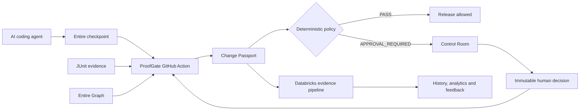
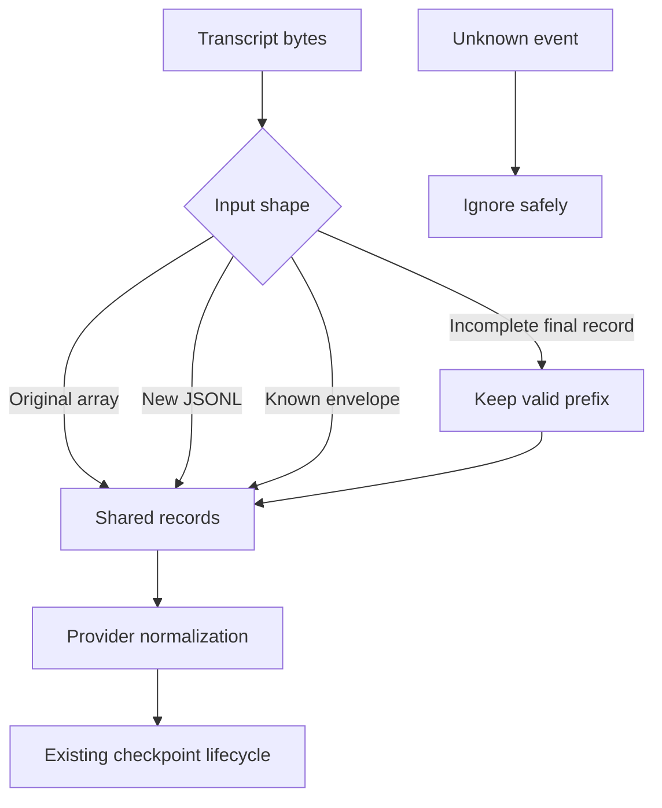

# ProofGate Buildathon Record

## Submission summary

ProofGate is a governed release gate for AI-authored software changes. It converts
Entire checkpoints, Git facts, test reports, and Entire Graph analysis into a compact
Change Passport, evaluates that evidence through deterministic policy, and explains
whether a change can pass automatically or requires human review.

The project targets Track 3 by integrating Entire into GitHub Actions and the software
review lifecycle. Databricks provides the operational evidence layer, analytics, and
Control Room data path; it does not replace ProofGate's deterministic enforcement.

## Problem

AI coding agents can produce useful changes quickly, but reviewers often receive only a
diff and a success claim. They cannot reliably answer:

- What intent and agent session produced this change?
- Which code relationships are affected?
- Were the relevant tests actually executed?
- Is the evidence complete enough for automatic release?
- If a human overrides the gate, is that decision auditable and replay-safe?

ProofGate makes those questions explicit and machine-checkable.

## Architecture

### Trust boundary

Trusted evidence includes repository state, validated Git and Entire metadata,
configured policy, normalized test artifacts, and governed approval records. Agent
claims, PR prose, arbitrary workflow input, raw prompts, and self-reported test results
are not treated as proof.

The system exports structured identifiers, counts, categories, safe intent summaries,
and hashes. Raw prompts, chain-of-thought, source code, and credentials are outside the
normal Databricks evidence payload.

## Vertical demo flow

1. A coding agent works under Entire and creates a checkpointed commit.
2. GitHub Actions runs the relevant tests and produces normalized JUnit evidence.
3. ProofGate reads the checkpoint and asks Entire Graph for semantic impact evidence.
4. ProofGate builds a Change Passport and applies deterministic policy.
5. A safe, well-evidenced change passes with a preserved artifact.
6. A risky or incomplete change stops with exact reasons.
7. A reviewer can approve or reject it through the Control Room.
8. The governed receipt is stored and the exact candidate SHA can be re-evaluated.
9. Databricks stores allowlisted evidence for history, fleet analytics, explanations,
   similarity search, and reliability feedback.

## Noon curveball response

The integration had to support a new transcript and lifecycle-event format while
remaining compatible with the original format.

The response keeps one shared parsing and normalization pipeline:

Implemented behavior:

- Original transcript format remains supported.
- The supplied new JSONL lifecycle format is supported.
- Unknown events are ignored without crashing the integration.
- An incomplete trailing record produces a clearly partial result instead of corrupting
  or discarding the valid prefix.
- Existing checkpoint storage preserves the supplied transcript bytes and lifecycle
  ordering.
- Codex and Cursor streams normalize into the same internal message model; the parser is
  not duplicated per provider.

Coverage includes original format, new format, unknown events, incomplete input,
provider detection, checkpoint compatibility, raw transcript preservation, token
calculation, and capture lifecycle behavior.

## Entire and Graph evidence

Meaningful event checkpoints include the initial understanding, pre-curveball stable
state, curveball implementation, hosted verification fixes, and final integration.

The final integration review used:

- Graph search to locate transcript, lifecycle, summary, and checkpoint-writing paths.
- Impact analysis on `parseSDKMessages`, reporting 8 direct and 8 transitive callers,
  6 callees, 2 type consumers, and 5 data-flow edges with complete Go parsing.
- Semantic diff analysis covering transcript normalization, capture/lifecycle paths,
  fixtures, JUnit processing, Change Passport metadata, review flow, and Databricks
  resources.
- Source inspection and tests to verify Graph output. Known Graph parser limitations for
  JSONL fixtures and Databricks-specific SQL are treated as uncertainty, not facts.

Final integration checkpoint: `ca99e1d9fae6`.

Hosted ProofGate verification checkpoint: `99fd92b52cbe`.

## GitHub Actions and provider integrations

The repository includes:

- A reusable ProofGate evaluation action.
- A PR/manual ProofGate workflow with exact-SHA re-evaluation.
- Codex and Cursor authoring workflow templates.
- A GitHub Actions Entire adapter that captures supported provider streams without
  requiring raw prompt or code export.
- Change Passport artifact preservation for review and demo evidence.

The OpenAI, Cursor, and Databricks workflow values are configured as GitHub Actions
secrets. They are not stored in this repository.

## Databricks integration

The implementation includes:

- Bronze ingestion for allowlisted ProofGate events.
- Silver normalization and Gold reliability/analytics outputs.
- Idempotent warehouse writes and governed review-decision lookup.
- A Databricks App Control Room.
- Lakebase-backed transactional review state.
- Vector Search for similar safe change summaries.
- A Databricks-hosted explanation endpoint for advisory explanations only.
- A fleet dashboard and Genie space definition.
- Automated resource definitions for jobs, app permissions, model access, search, and
  governed GitHub reruns.

Live verification completed:

- The development Databricks bundle validates against the real workspace.
- The Phase 2 bundle resolves successfully with the workspace configuration.
- ProofGate completed a real GitHub Actions run with a checkpointed candidate.
- The run produced `PASS`, risk score `0`, and `0` hard stops.
- Databricks ingestion succeeded and returned a completed statement and event ID.
- Historical lookup was explicitly marked degraded because usable historical baseline
  data was not yet available; the gate continued with labelled partial history.

## Verification evidence

Hosted checks on merged `main`:

- [CI](https://github.com/Subramanyarao11/external-agents/actions/runs/34024719361): passed.
- [Lint](https://github.com/Subramanyarao11/external-agents/actions/runs/34024719322): passed.
- [Protocol Compliance](https://github.com/Subramanyarao11/external-agents/actions/runs/34024719326): passed.
- [License Check](https://github.com/Subramanyarao11/external-agents/actions/runs/34024719794): passed.
- [ProofGate live run](https://github.com/Subramanyarao11/external-agents/actions/runs/34024895649): passed with an uploaded Change Passport.

Local verification also passed for the GitHub Actions adapter, ProofGate packages, e2e
module, provider fixtures, Control Room tests, workflow lint, offline Graph contract,
and authenticated Databricks bundle validation.

## Team contributions

| Team member | Contribution area |
|---|---|
| Subramanya | Integration ownership, GitHub Actions gate, deterministic policy, live Databricks/GitHub verification, and final submission |
| Daksh | Control Room, approval integrity, rerun behavior, and Databricks operational path |
| Rohit | Final integration batch, JUnit evidence, Codex/Cursor capture, Graph contracts, and verification documentation |

## Baseline disclosure

The project used a pre-existing 14-commit implementation baseline whose reuse the team
reports was approved by the organizers. The original Git objects, authorship, timestamps,
and ancestry remain unchanged. The baseline was integrated in ordered batches; genuine
event work, curveball changes, conflict resolution, verification, and follow-up fixes were
captured separately through Entire. This document does not claim that the baseline was
newly authored during the event.

## Known limitations and next demo steps

- Populate enough historical events to demonstrate non-degraded history lookup and
  similarity trends.
- Deploy and visually verify the final Control Room and Lakebase resources in the target
  workspace.
- Demonstrate the full blocked change → governed approval → exact-SHA rerun →
  `HUMAN_APPROVED` sequence.
- Activate and run one Codex or Cursor authoring template with its configured provider
  secret.
- Treat advisory model explanations and Graph output as evidence aids; deterministic
  policy remains the enforcement authority.
