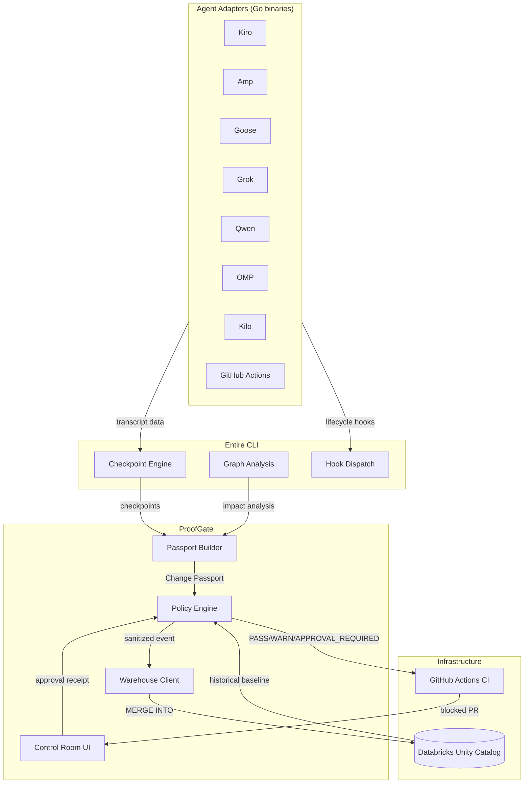
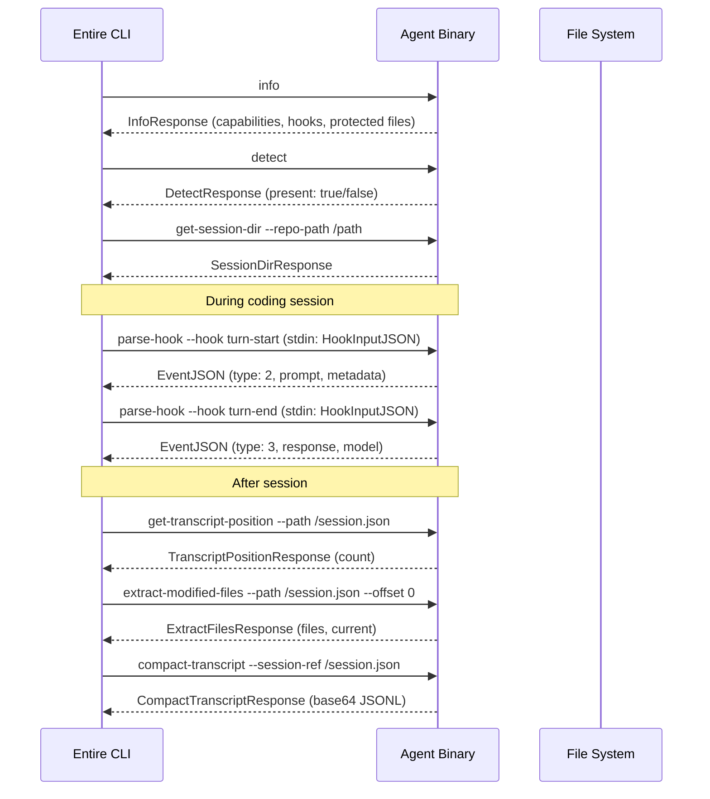
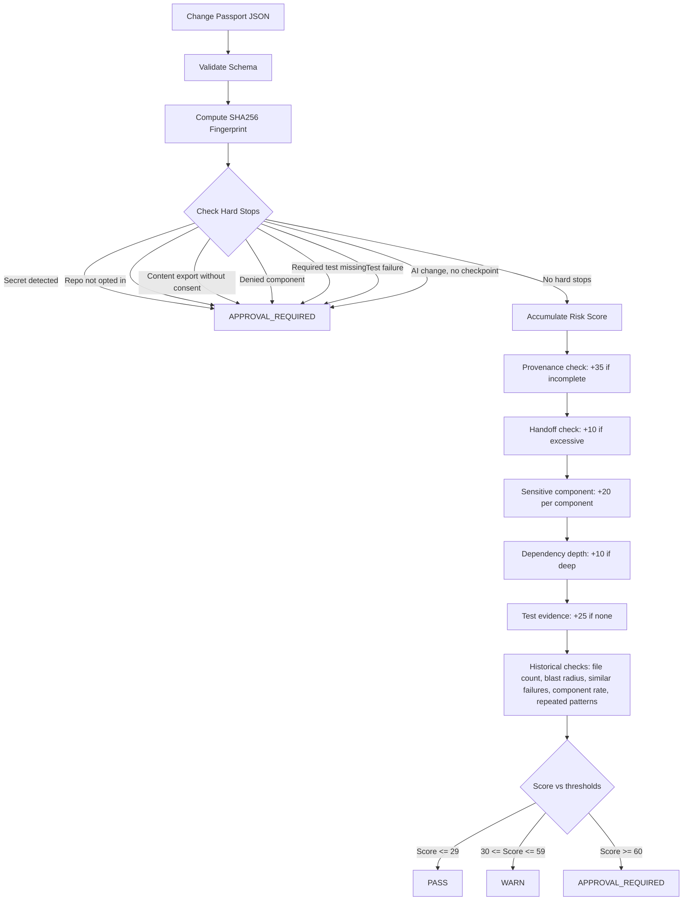
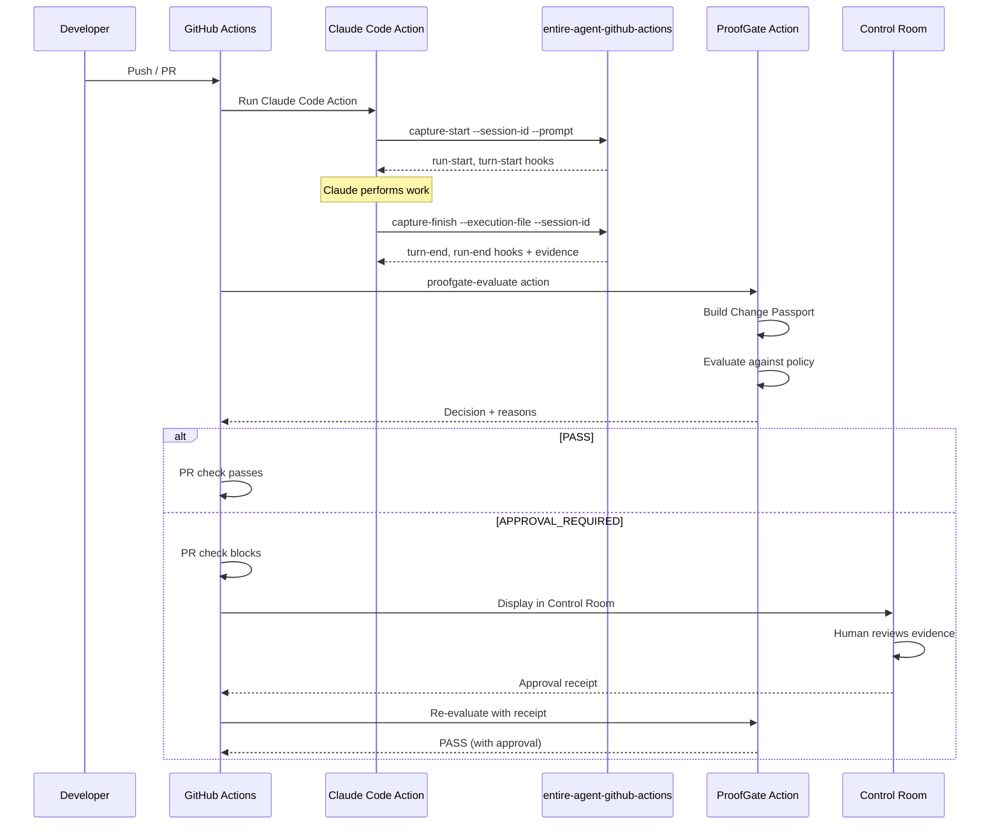
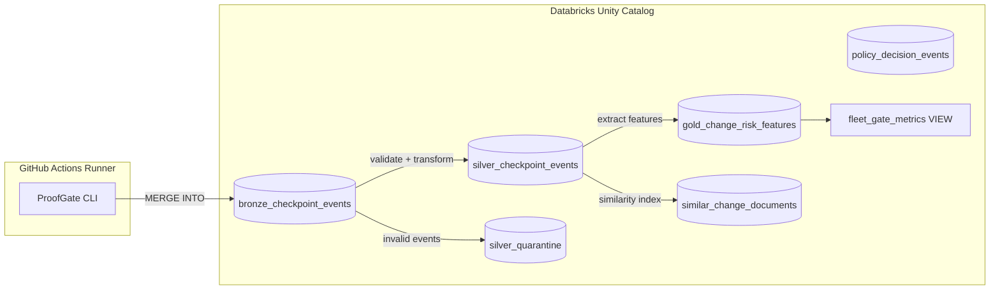
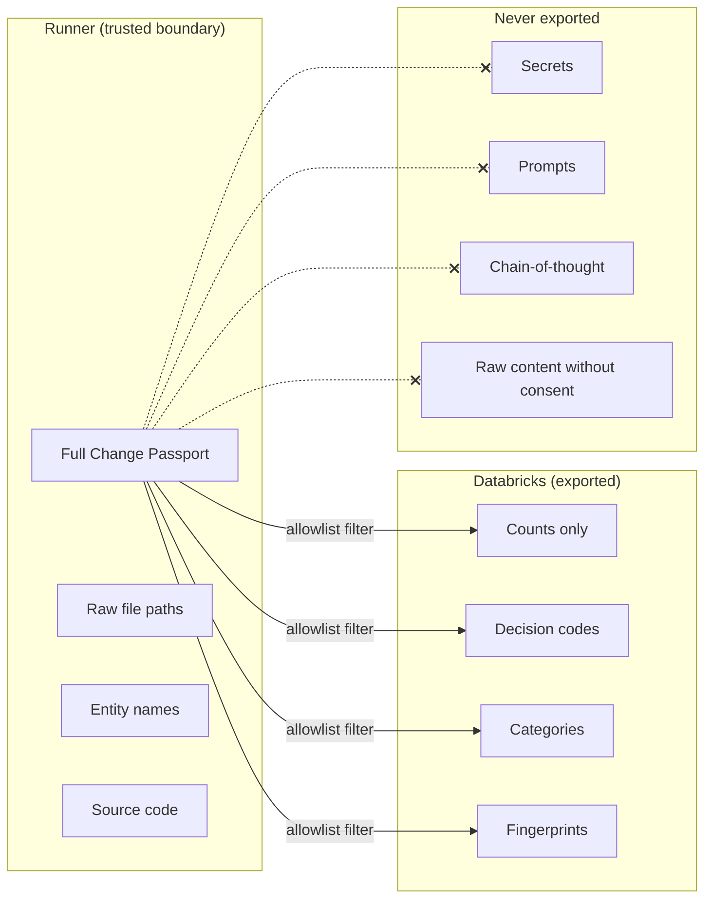
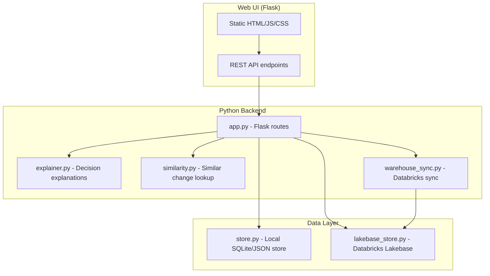

# Architecture

## System overview

The system comprises three layers: **agent adapters** that capture AI coding sessions, a **deterministic policy engine** that evaluates evidence and produces decisions, and an **evidence pipeline** that persists sanitized results for historical analysis.

## External agent protocol

Every agent adapter implements the same stdin/stdout JSON protocol. The Entire CLI invokes agent binaries as subprocesses with specific subcommands.

### Protocol message types

| Type ID | Name | Direction | Description |
|---|---|---|---|
| 1 | SessionStart (`run-start`) | Agent → CLI | Session begins |
| 2 | TurnStart (`turn-start`) | Agent → CLI | User prompt received |
| 3 | TurnEnd (`turn-end`) | Agent → CLI | Agent response complete |
| 5 | SessionEnd (`run-end`) | Agent → CLI | Session finished |

### Agent capabilities

Each agent declares capabilities in its `info` response:

| Capability | Description |
|---|---|
| `hooks` | Lifecycle event handlers (start, stop, commit) |
| `transcript_analyzer` | Extract files, prompts, summaries from transcripts |
| `token_calculator` | Count input/output/cache tokens |
| `compact_transcript` | Produce base64-encoded JSONL compact format |
| `transcript_preparer` | Format transcripts for display |
| `text_generator` | Generate agent-specific output |
| `hook_response_writer` | Custom hook responses |
| `subagent_aware_extractor` | Handle nested agent sessions |

## ProofGate decision flow

### Decision types

| Decision | Meaning | Action |
|---|---|---|
| `PASS` | Risk score within acceptable range, no hard stops | Auto-approve merge |
| `WARN` | Elevated risk, review recommended | Merge allowed with warnings |
| `APPROVAL_REQUIRED` | Hard stop triggered or high risk score | Block until human review |

## GitHub Actions integration flow

## Databricks evidence pipeline

### Data tiers

| Tier | Table | Purpose |
|---|---|---|
| Bronze | `bronze_checkpoint_events` | Raw allowlisted events from runners |
| Silver | `silver_checkpoint_events` | Validated, deduplicated events |
| Silver | `silver_quarantine` | Invalid events with quarantine reasons |
| Gold | `gold_change_risk_features` | Extracted features for analytics/ML |
| Gold | `similar_change_documents` | Similarity search index |
| Audit | `policy_decision_events` | Human review decisions |
| View | `fleet_gate_metrics` | Aggregated daily metrics |

## Privacy boundary

**Allowlisted fields** (safe to export):
- Counts: file count, entity count, line count, session count
- Codes: risk reason codes, hard stop codes, decision
- Categories: agent family, model family, tool categories, sensitive components
- Identifiers: event ID, commit SHA, checkpoint ID, repo ID (synthetic)
- Metadata: timestamps, policy version, redaction version, fingerprints
- Similarity: safe categorized summary (e.g., `agent=claude decision=PASS blast_radius=small`)

**Redacted fields** (dropped, counted in `dropped_field_count`):
- Individual file paths → replaced by `changed_file_count`
- Individual entity names → replaced by `impacted_entity_count`
- Raw source code, prompts, chain-of-thought: never included

## Control Room architecture

The Control Room (`proofgate/app/`) is a Python web application for human review of blocked changes.

