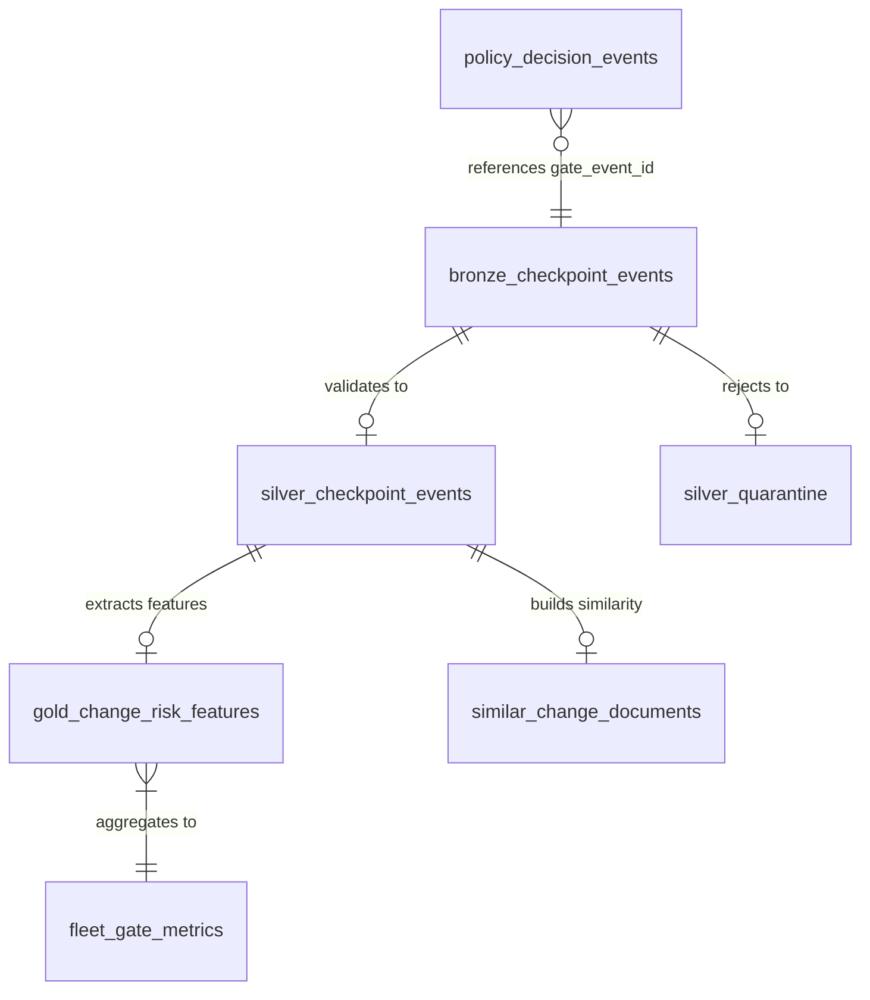
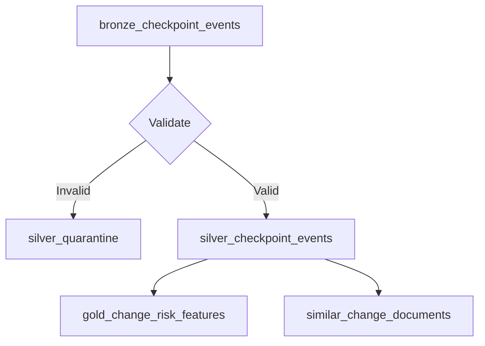

# Database — Databricks Evidence Pipeline

ProofGate uses Databricks Unity Catalog with a medallion architecture (bronze → silver → gold) to store and analyze code change evidence.

## Connection configuration

| Environment variable | Description | Example |
|---|---|---|
| `DATABRICKS_HOST` | Workspace HTTPS URL | `https://workspace.cloud.databricks.com` |
| `DATABRICKS_TOKEN` | Bearer API token | `dapi...` |
| `DATABRICKS_SQL_WAREHOUSE_ID` | SQL warehouse ID | `abc123def456` |
| `PROOFGATE_DATABRICKS_CATALOG` | Unity Catalog name | `main` |
| `PROOFGATE_DATABRICKS_SCHEMA` | Schema name | `proofgate_dev` |

The Go warehouse client (`proofgate/warehouse/client.go`) enforces:
- HTTPS-only host URL
- All config fields required
- HTTP client timeout: 55 seconds
- Response size limit: 2 MB

## Schema diagram



## Tables

### `bronze_checkpoint_events` (Raw ingestion)

Source: `proofgate/databricks/sql/001_setup.sql`

Stores raw allowlisted events directly from GitHub Actions runners via parameterized `MERGE INTO` statements.

| Column | Type | Description |
|---|---|---|
| `event_id` | STRING | Idempotency key (from passport) |
| `event_type` | STRING | Always `change_passport_evaluated` |
| `schema_version` | STRING | `1.0` |
| `occurred_at` | TIMESTAMP | When the change occurred |
| `ingested_at` | TIMESTAMP | When the event was received |
| `repo_id` | STRING | Synthetic repository identifier |
| `commit_sha` | STRING | Git commit hash |
| `checkpoint_id` | STRING | Entire checkpoint reference |
| `source_adapter` | STRING | Integration source (e.g., `github-actions@1`) |
| `policy_version` | STRING | Policy version used for evaluation |
| `payload_hash` | STRING | SHA256 of the full event payload |
| `redaction_version` | STRING | `proofgate-allowlist-v1` |
| `dropped_field_count` | INT | Number of redacted fields |
| `payload_json` | STRING | Full ChangeEvent as JSON |

- Delta format with Change Data Feed enabled
- Idempotent ingestion via `MERGE INTO ... ON event_id`

### `silver_checkpoint_events` (Validated)

Validated events promoted from bronze after schema, checkpoint, and payload checks.

| Column | Type | Description |
|---|---|---|
| `event_id` | STRING | Validated event identifier |
| `event_type` | STRING | Event type |
| `schema_version` | STRING | Schema version |
| `occurred_at` | TIMESTAMP | Original event time |
| `ingested_at` | TIMESTAMP | Bronze ingestion time |
| `validated_at` | TIMESTAMP | Validation timestamp |
| `source_event_id` | STRING | Reference to bronze event |
| `repo_id` | STRING | Repository identifier |
| `commit_sha` | STRING | Commit hash |
| `checkpoint_id` | STRING | Checkpoint reference |
| `source_adapter` | STRING | Source adapter |
| `policy_version` | STRING | Policy version |
| `payload_hash` | STRING | Payload hash |
| `redaction_version` | STRING | Redaction version |
| `dropped_field_count` | INT | Redacted field count |
| `payload_json` | STRING | Validated payload |

### `silver_quarantine` (Invalid events)

Events that failed validation, with quarantine reasons.

| Column | Type | Description |
|---|---|---|
| `event_id` | STRING | Failed event identifier |
| `payload_hash` | STRING | Payload hash |
| `quarantine_reason` | STRING | Why the event was rejected |
| `source_ingested_at` | TIMESTAMP | Original ingestion time |
| `quarantined_at` | TIMESTAMP | When quarantined |

**Quarantine reasons:**

| Reason | Description |
|---|---|
| `UNSUPPORTED_SCHEMA_VERSION` | Schema version not `1.0` |
| `MISSING_CHECKPOINT_ID` | No checkpoint reference |
| `UNSUPPORTED_REDACTION_VERSION` | Unknown redaction policy |
| `INVALID_PAYLOAD_JSON` | Malformed payload |
| `UNKNOWN_VALIDATION_ERROR` | Catch-all validation failure |

### `gold_change_risk_features` (Analytics)

Extracted features from validated events for ML, analytics, and dashboards.

| Column | Type | Description |
|---|---|---|
| `event_id` | STRING | Source event |
| `repo_id` | STRING | Repository |
| `commit_sha` | STRING | Commit |
| `checkpoint_id` | STRING | Checkpoint |
| `occurred_at` | TIMESTAMP | Event time |
| `decision` | STRING | `PASS` / `WARN` / `APPROVAL_REQUIRED` |
| `risk_score` | INT | 0–100 |
| `reason_codes` | ARRAY\<STRING\> | Risk reason codes |
| `hard_stop_codes` | ARRAY\<STRING\> | Blocking codes |
| `agent_family` | STRING | Agent type |
| `model_family` | STRING | Model variant |
| `session_count` | INT | Sessions |
| `handoff_count` | INT | Handoffs |
| `changed_file_count` | INT | Files changed |
| `changed_line_count` | INT | Lines changed |
| `impacted_entity_count` | INT | Entities impacted |
| `dependency_depth` | INT | Dependency depth |
| `test_total` | INT | Total tests |
| `test_failed` | INT | Failed tests |
| `provenance_complete` | BOOLEAN | Provenance status |
| `history_available` | BOOLEAN | Historical data present |
| `history_snapshot_at` | TIMESTAMP | History snapshot time |
| `similar_failure_rate` | DOUBLE | Similar change failure rate |
| `component_failure_rate` | DOUBLE | Component failure rate |
| `feature_generated_at` | TIMESTAMP | Feature extraction time |

### `similar_change_documents` (Similarity index)

Documents for vector similarity search to find historically similar changes.

| Column | Type | Description |
|---|---|---|
| `event_id` | STRING | Source event |
| `repo_id` | STRING | Repository |
| `checkpoint_id` | STRING | Checkpoint |
| `occurred_at` | TIMESTAMP | Event time |
| `decision` | STRING | Decision |
| `risk_score` | INT | Risk score |
| `similarity_summary` | STRING | Safe categorized metadata |

**Similarity summary format:**
```
agent=claude-code-action decision=PASS blast_radius=small change_size=small sensitive=authentication reason=incomplete-provenance
```

### `policy_decision_events` (Audit trail)

Manual review decisions from Control Room.

| Column | Type | Description |
|---|---|---|
| `decision_event_id` | STRING | Decision identifier |
| `gate_event_id` | STRING | Original gate event |
| `checkpoint_id` | STRING | Checkpoint reference |
| `action` | STRING | `APPROVED` or `DENIED` |
| `actor_id` | STRING | Reviewer identity |
| `expected_version` | INT | Optimistic concurrency version |
| `decision_reason` | STRING | Reviewer's rationale |
| `policy_version` | STRING | Policy version at decision time |
| `occurred_at` | TIMESTAMP | Decision time |
| `idempotency_key` | STRING | Prevents duplicate decisions |

### `fleet_gate_metrics` (View)

Aggregated daily metrics across the fleet.

| Column | Type | Description |
|---|---|---|
| `repo_id` | STRING | Repository |
| `policy_version` | STRING | Policy version |
| `evaluation_day` | DATE | Aggregation date |
| `total_evaluations` | BIGINT | Total count |
| `provenance_complete_count` | BIGINT | With complete provenance |
| `pass_count` | BIGINT | PASS decisions |
| `warn_count` | BIGINT | WARN decisions |
| `approval_required_count` | BIGINT | APPROVAL_REQUIRED decisions |
| `avg_risk_score` | DOUBLE | Average risk score |
| `test_failure_rate` | DOUBLE | Test failure ratio |

## Data transformation pipeline

Source: `proofgate/databricks/sql/002_transform.sql`



**Validation checks:**
1. Schema version = `1.0`
2. Checkpoint ID present
3. Redaction version = `proofgate-allowlist-v1`
4. Payload JSON valid

**Feature extraction:**
- Extracts ~30 feature columns from `payload_json` using `get_json_object()`
- Builds categorized similarity summaries for vector search

## Databricks bundle deployment

Source: `proofgate/databricks/databricks.yml`

**Bundle name:** `entire-proofgate`

**Variables:**
- `catalog` (default: `main`)
- `schema` (default: `proofgate_dev`)
- `warehouse_id` (required, no default)

**Jobs:**
- `proofgate_prepare` — Two SQL tasks:
  1. `setup_tables` → runs `001_setup.sql`
  2. `transform_evidence` → runs `002_transform.sql` (depends on setup)

**Targets:**
- `dev` (default) — development workspace
- `demo` — production workspace

```bash
# Deploy to dev target
databricks bundle deploy --target dev

# Deploy to demo target
databricks bundle deploy --target demo
```

## Ingestion API

The Go warehouse client (`proofgate/warehouse/client.go`) uses the Databricks SQL Statement Execution API:

- **Endpoint:** `POST /api/2.0/sql/statements`
- **Auth:** Bearer token
- **Method:** Parameterized MERGE (prevents SQL injection)
- **Idempotency:** `ON target.event_id = source.event_id`
- **Wait timeout:** 50 seconds
- **Polling interval:** 500ms
- **Max concurrent runs:** 1

```go
client, err := warehouse.NewClient(warehouse.Config{
    Host:        os.Getenv("DATABRICKS_HOST"),
    Token:       os.Getenv("DATABRICKS_TOKEN"),
    WarehouseID: os.Getenv("DATABRICKS_SQL_WAREHOUSE_ID"),
    Catalog:     os.Getenv("PROOFGATE_DATABRICKS_CATALOG"),
    Schema:      os.Getenv("PROOFGATE_DATABRICKS_SCHEMA"),
})
result, err := client.Ingest(ctx, event)
```
