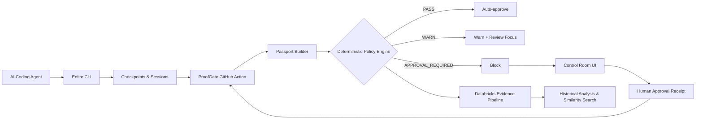

# ProofGate & External Agents — Project Overview

## What is this project?

This repository provides two integrated systems:

1. **External Agents** — A plugin architecture for integrating third-party AI coding agents (Kiro, Amp, Goose, Grok, Qwen, OMP, Kilo) with the [Entire CLI](https://entire.io), enabling checkpoint-based development provenance tracking across diverse agent ecosystems.

2. **ProofGate** — A deterministic policy engine that evaluates AI-generated code changes against configurable risk policies, produces auditable change passports, and optionally exports sanitized evidence to Databricks for historical analysis. It includes a GitHub Action for CI integration and a Control Room web UI for human review decisions.

## Problem statement

When AI coding agents generate code changes, organizations need:

- **Provenance**: Who (or what) authored each change and how?
- **Risk assessment**: Is this change safe to merge without human review?
- **Audit trail**: What evidence supports the decision to merge or block?
- **Historical analysis**: How do similar changes perform over time?

ProofGate solves this by inserting a deterministic evaluation gate between AI agent work and code merge, using verifiable evidence (Entire checkpoints, test results, Graph impact analysis) rather than trusting model self-reports.

## High-level architecture



## Key design principles

- **Deterministic enforcement**: The policy engine, not a language model, makes merge decisions. Same input always produces the same output.
- **Evidence-based trust**: Only verifiable artifacts (Git state, Entire checkpoints, test results, Graph analysis) are trusted. Agent claims and PR text are untrusted.
- **Privacy by design**: Databricks exports use an allowlist — only counts, codes, and categories leave the runner. Raw file paths, source code, prompts, and secrets are never exported.
- **Transparent history**: Imported baseline commits preserve original SHAs, authors, and dates without rewriting.

## Repository structure

| Directory | Purpose |
|---|---|
| `agents/entire-agent-*` | External agent adapters (8 agents) |
| `proofgate/` | Deterministic policy engine, CLI, warehouse client |
| `proofgate/app/` | Control Room web UI (Python/Flask) |
| `proofgate/passportbuilder/` | Change passport construction from Entire checkpoints |
| `proofgate/databricks/` | Databricks SQL schemas and bundle configuration |
| `.github/actions/proofgate-evaluate/` | Packaged GitHub Action for CI integration |
| `e2e/` | End-to-end lifecycle test framework |
| `.github/workflows/` | CI/CD pipelines (test, lint, compliance, license) |

## Technology stack

| Component | Technology |
|---|---|
| Agent adapters | Go 1.26.0 |
| Policy engine | Go 1.26.0 |
| Control Room UI | Python (Flask, Dash) |
| Evidence pipeline | Databricks (Unity Catalog, SQL Warehouse) |
| CI integration | GitHub Actions (composite action) |
| Code graph | Entire Graph v0.4.0 |
| Task runner | mise |
| Linting | golangci-lint v2.11.3 (52 linters) |

## Supported agents

| Agent | Binary | Description |
|---|---|---|
| Kiro | `entire-agent-kiro` | IDE/CLI coding agent with SQLite session storage |
| Amp | `entire-agent-amp` | Token calculator + compact transcripts |
| Goose | `entire-agent-goose` | Terminal agent with hooks + transcripts |
| Grok | `entire-agent-grok` | Build CLI with native transcript parsing |
| Qwen | `entire-agent-qwen` | Qwen Code terminal agent |
| OMP | `entire-agent-omp` | Oh My Pi interactive agent |
| Kilo | `entire-agent-kilo` | JSONL transcript support + token calc |
| GitHub Actions | `entire-agent-github-actions` | Claude in GitHub Actions workflows |

## Quick start

```bash
# Build all agents
mise run build

# Run all unit tests
mise run test

# Run e2e lifecycle tests (requires tmux + agent CLIs)
mise run test:e2e

# Evaluate a change passport
cd proofgate
go run ./cmd/proofgate evaluate --passport examples/pass.json --now 2026-09-04T12:00:00Z

# Get default policy
go run ./cmd/proofgate default-policy
```

## Related documentation

- [Architecture](./architecture.md) — System design and data flow
- [Project Structure](./project-structure.md) — Directory layout and file purposes
- [API Reference](./api.md) — ProofGate CLI, protocol, and Control Room endpoints
- [Database](./database.md) — Databricks schema and evidence pipeline
- [Authentication](./authentication.md) — Credentials and access control
- [Development](./development.md) — Local setup and contribution guide
- [Testing](./testing.md) — Test architecture and execution
- [Deployment](./deployment.md) — CI/CD, GitHub Actions, and Databricks deployment
- [Troubleshooting](./troubleshooting.md) — Common issues and debugging
