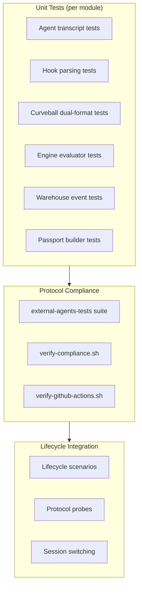

# Testing

## Test architecture

The project uses a three-tier test strategy:



## Unit tests

### Running

```bash
# All modules
mise run test

# Specific agent
cd agents/entire-agent-github-actions && go test ./...

# ProofGate
cd proofgate && go test ./...

# Verbose with specific test
cd proofgate && go test -v ./engine -run TestEvaluateAcceptanceScenarios
```

### Agent adapter tests

Each agent has tests for its core functionality:

| Agent | Test files | Coverage |
|---|---|---|
| GitHub Actions | `hooks_test.go`, `transcript_test.go`, `curveball_transcript_test.go` | Hook parsing, transcript analysis, dual-format support, capture lifecycle |
| Kiro | `agent_test.go`, `compact_test.go`, `hooks_test.go`, `lifecycle_test.go`, `paths_test.go`, `info_test.go` | Session management, SQLite storage, lifecycle events |
| Amp | `command_runner_test.go`, `compact_test.go`, `hooks_test.go`, `transcript_test.go`, `handlers_test.go` | Command execution, token calculation, compact transcripts |
| Goose | `compact_test.go`, `hooks_test.go`, `transcript_test.go` | Hook dispatch, transcript parsing |
| Grok | `agent_test.go`, `native_transcript_test.go`, `paths_test.go` | Native transcript format, lifecycle events |
| Kilo | `command_runner_test.go`, `compact_test.go`, `hooks_test.go`, `jsonl_test.go`, `transcript_test.go` | JSONL support, token calculation |
| OMP | `agent_test.go`, `compact_test.go`, `hooks_test.go`, `paths_test.go`, `transcript_test.go` | Interactive sessions, transcript analysis |
| Qwen | `agent_test.go` | Basic agent operations |

### Curveball tests (GitHub Actions agent)

The curveball tests (`curveball_transcript_test.go`) verify dual-format transcript support — a requirement introduced during the buildathon noon curveball:

| Test | What it verifies |
|---|---|
| `TestCurveballTranscriptFormats/legacy_JSON_array` | Original JSON array format still works |
| `TestCurveballTranscriptFormats/official_JSONL` | New JSONL format (17-record fixture) works |
| `TestCurveballUnknownEventIgnored` | Unknown JSONL events are skipped without error |
| `TestCurveballIncompleteJSONLReturnsPartialResult` | Truncated JSONL yields all complete records |
| `TestCurveballEntirelyIncompleteJSONLReturnsEmptyPartialResult` | First record incomplete yields empty result |
| `TestCurveballMalformedCompleteJSONLRecordFails` | Malformed complete records produce errors |
| `TestCurveballCaptureFinishPreservesRawTranscriptAndLifecycle` | Raw bytes stored exactly, lifecycle hooks dispatched |
| `TestCurveballCaptureFinishPreservesIncompleteTranscript` | Partial transcripts stored and parsed correctly |

### ProofGate engine tests

| Test | What it verifies |
|---|---|
| `TestEvaluateAcceptanceScenarios` | 6 scenarios: pass, missing checkpoint, test failure, secret, historical blast, combined risks |
| `TestEvaluateIsDeterministic` | Same input produces identical output across runs |

### ProofGate warehouse tests

| Test | What it verifies |
|---|---|
| `TestBuildEventDropsRawPathsAndEntities` | File paths and entity names replaced by counts |
| `TestBuildEventRefusesUnsafeExport` | SecretDetected blocks export |
| `TestClientUsesParameterizedIdempotentMerge` | SQL injection prevention, idempotency |

### Passport builder tests

| Test | What it verifies |
|---|---|
| `TestBuildFromEntireCheckpointAndTestEvidence` | Passport construction from checkpoint data |
| `TestBuildWithoutCheckpointPreservesAIAuthoredSignal` | AI-authored flag preserved without checkpoint |
| `TestBuildDetectsSecretShapeWithoutRetainingDiff` | Secret detection without storing the secret |
| `TestSkippedRequiredSuiteIsMarkedMissing` | Missing required suite flagged correctly |

## Protocol compliance tests

The shared compliance suite (`entireio/external-agents-tests`) validates every agent against the protocol specification.

### Running locally

```bash
# Build the agent
cd agents/entire-agent-github-actions
go build -o entire-agent-github-actions ./cmd/entire-agent-github-actions

# Run compliance
./scripts/verify-compliance.sh ./entire-agent-github-actions
```

### What it tests

- All JSON subcommands produce valid responses
- Required capabilities are implemented
- Hook parsing produces correct event types
- Transcript operations return expected structures
- Error handling (invalid input, missing flags)

### GitHub Actions verification

```bash
# Local structure verification (no live runner)
./agents/entire-agent-github-actions/scripts/verify-github-actions.sh --sample

# With a real execution file
./agents/entire-agent-github-actions/scripts/verify-github-actions.sh \
  --execution-file /path/to/claude-output.json
```

## E2E lifecycle tests

### Prerequisites

- `tmux` installed and in PATH
- Agent CLIs available (built or in PATH)
- Entire CLI installed and authenticated

### Running

```bash
# All agents
mise run test:e2e

# Specific agent
E2E_AGENT=github-actions mise run test:e2e

# Keep temp repos for post-mortem
E2E_KEEP_REPOS=1 mise run test:e2e

# Custom artifact directory
E2E_ARTIFACT_DIR=/tmp/my-artifacts mise run test:e2e
```

### Lifecycle scenarios

| Scenario | Description |
|---|---|
| `TestLifecycle_DetectAndEnable` | Agent detection and `entire enable` |
| `TestLifecycle_HooksInstalledAfterEnable` | Hook files created after enable |
| `TestLifecycle_SinglePromptManualCommit` | One prompt → file change → commit → checkpoint |
| `TestLifecycle_MultiplePromptsManualCommit` | Two prompts → single commit → checkpoint covers both |
| `TestLifecycle_RewindPreCommit` | Shadow branch rewind before user commit |
| `TestLifecycle_RewindAfterCommit` | Rewind after commit (shadow → logs-only) |
| `TestLifecycle_SessionPersistence` | Session files created in agent directory |
| `TestLifecycle_InteractiveSession` | Interactive tmux prompt/response cycling |

### Concurrency

Tests run in parallel with per-agent concurrency gates:

| Agent | Max concurrent | Timeout multiplier |
|---|---|---|
| Kiro | 2 | 1.0x |
| Goose | 2 | 2.0x |
| GitHub Actions | 1 | 4.0x |
| Others | 2 | 1.0x |

Override with `E2E_CONCURRENT_TEST_LIMIT` environment variable.

### Transient error handling

The framework automatically retries on transient API failures:

- Rate limits (429, 529)
- Server errors (500, 503)
- Connection issues (ECONNRESET, ETIMEDOUT)
- Max 3 attempts (initial + 2 retries)
- Full scenario restart (new repo, fresh state)

### Test artifacts

On every test completion (pass or fail), artifacts are captured to `e2e/artifacts/<timestamp>/<test-name>/`:

| File | Content |
|---|---|
| `git-log.txt` | Full git history with decorations |
| `git-tree.txt` | File tree at HEAD and checkpoint branch |
| `pane.txt` | Final tmux pane content (interactive tests) |
| `console.log` | All prompts, outputs, git commands |
| `PASS` or `FAIL` | Test result marker |
| `checkpoint-metadata/` | Checkpoint and session metadata JSON |
| `entire-logs/` | Entire CLI debug logs |

### Deep checkpoint validation

`ValidateCheckpointDeep()` in `e2e/testutil/assertions.go` performs comprehensive checks:

1. Metadata completeness (CLI version, strategy, sessions)
2. Strategy name matches expected
3. Files touched verification
4. Session metadata cross-references checkpoint ID
5. Transcript JSONL validity (each line is valid JSON)
6. SHA256 content hash verification
7. Prompt content matches expected

## CI pipeline tests

All tests run automatically on PR and push to main:

| Workflow | What runs |
|---|---|
| `ci.yml` | Unit tests + build for all agents (matrix) |
| `lint.yml` | gofmt + golangci-lint per agent + e2e |
| `protocol-compliance.yml` | Shared protocol compliance suite |
| `license-check.yml` | License verification |

### Local CI reproduction

```bash
# Reproduce CI test run
mise run test

# Reproduce CI lint
mise run lint

# Reproduce CI format check
gofmt -l .
```
